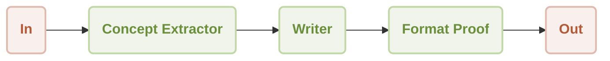
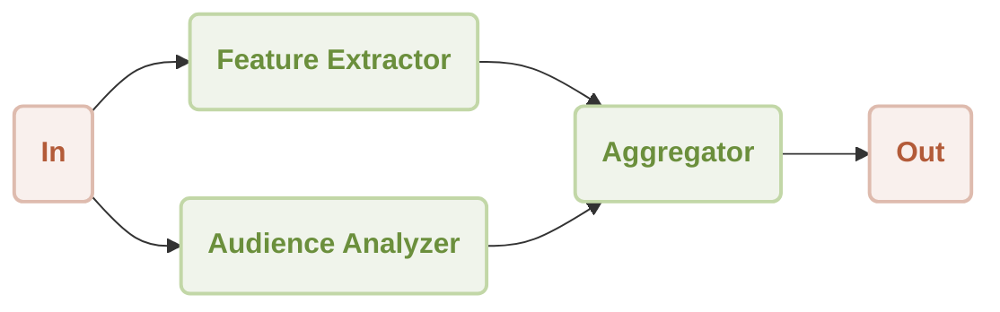
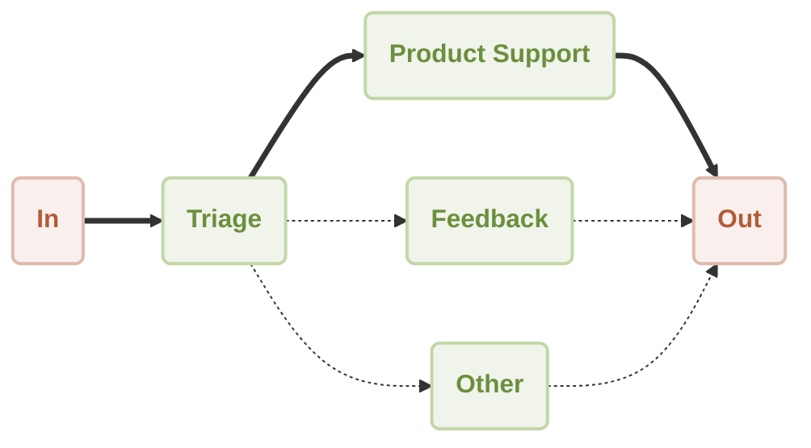
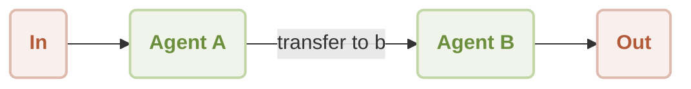
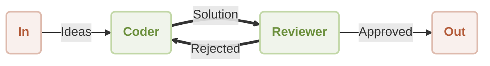
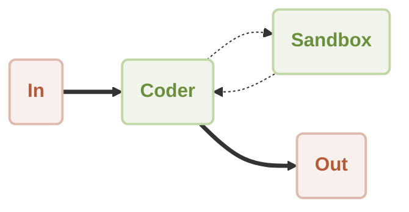

<p align="center">
  <picture>
    <source srcset="https://raw.githubusercontent.com/AIGNE-io/aigne-framework/main/logo-dark.svg" media="(prefers-color-scheme: dark)">
    <source srcset="https://raw.githubusercontent.com/AIGNE-io/aigne-framework/main/logo.svg" media="(prefers-color-scheme: light)">
    
  </picture>
</p>

[](https://star-history.com/#AIGNE-io/aigne-framework)
[](https://github.com/AIGNE-io/aigne-framework/issues)
[](https://codecov.io/gh/AIGNE-io/aigne-framework)
[](https://www.npmjs.com/package/@aigne/core)
[](https://github.com/AIGNE-io/aigne-framework/blob/main/LICENSE.md)

## What is AIGNE Framework

AIGNE Framework is a functional AI application development framework designed to simplify and accelerate the process of building modern applications. It combines functional programming features, powerful artificial intelligence capabilities, and modular design principles to help developers easily create scalable solutions. AIGNE Framework is also deeply integrated with the Blocklet ecosystem, providing developers with a wealth of tools and resources.

📛 AIGNE Name & Meaning  
[ ˈei dʒən ] — like “agent” without the t


🔤 Pronunciation  
It’s pronounced **[ ˈei dʒən ]** — like *“agent” without the “t.”*

🏞️ Origin  
*Aigne* is a small medieval village in southern France.  
In **Old Irish**, *aigne* means **“spirit”** — a perfect metaphor for agents that think and act.

🔡 Acronym  
**AIGNE** = *Artificial Intelligence & Generative Natural-Language Ecosystem*  
An open framework for building real AI agents that live across cloud, browser, and edge.

## Architecture diagram


## Key Features

* **Modular Design**: With a clear modular structure, developers can easily organize code, improve development efficiency, and simplify maintenance.
* **TypeScript Support**: Comprehensive TypeScript type definitions are provided, ensuring type safety and enhancing the developer experience.
* **Multiple AI Model Support**: Built-in support for OpenAI, Gemini, Claude, Nova and other mainstream AI models, easily extensible to support additional models.
* **Flexible Workflow Patterns**: Support for sequential, concurrent, routing, handoff and other workflow patterns to meet various complex application requirements.
* **MCP Protocol Integration**: Seamless integration with external systems and services through the Model Context Protocol.
* **Code Execution Capabilities**: Support for executing dynamically generated code in a secure sandbox, enabling more powerful automation capabilities.
* **Blocklet Ecosystem Integration**: Closely integrated with ArcBlock's Blocklet ecosystem, providing developers with a one-stop solution for development and deployment.

## Quick Start

### Environment Requirements

* Node.js version 20.0 or higher

### Installation

#### Using npm

```bash
npm install @aigne/core
```

#### Using yarn

```bash
yarn add @aigne/core
```

#### Using pnpm

```bash
pnpm add @aigne/core
```

### Usage Example

```ts file="/examples/workflow-handoff/usages.ts"
import { AIAgent, AIGNE } from "@aigne/core";
import { OpenAIChatModel } from "@aigne/openai";

const { OPENAI_API_KEY } = process.env;

const model = new OpenAIChatModel({
  apiKey: OPENAI_API_KEY,
});

function transferToB() {
  return agentB;
}

const agentA = AIAgent.from({
  name: "AgentA",
  instructions: "You are a helpful agent.",
  outputKey: "A",
  skills: [transferToB],
  inputKey: "message",
});

const agentB = AIAgent.from({
  name: "AgentB",
  instructions: "Only speak in Haikus.",
  outputKey: "B",
  inputKey: "message",
});

const aigne = new AIGNE({ model });

const userAgent = aigne.invoke(agentA);

const result1 = await userAgent.invoke({ message: "transfer to agent b" });
console.log(result1);
// Output:
// {
//   B: "Transfer now complete,  \nAgent B is here to help.  \nWhat do you need, friend?",
// }

const result2 = await userAgent.invoke({ message: "It's a beautiful day" });
console.log(result2);
// Output:
// {
//   B: "Sunshine warms the earth,  \nGentle breeze whispers softly,  \nNature sings with joy.  ",
// }
```

## Simplifying Agentic Workflows

The AIGNE Framework offers multiple workflow patterns, each tailored to address distinct application scenarios efficiently.

### Workflow Patterns

* [Workflow Router](./examples/workflow-router/README.md) - Implement intelligent routing logic to direct requests to appropriate handlers based on content.
* [Workflow Sequential](./examples/workflow-sequential/README.md) - Build step-by-step processing pipelines with guaranteed execution order.
* [Workflow Concurrency](./examples/workflow-concurrency/README.md) - Optimize performance by processing multiple tasks simultaneously with parallel execution.
* [Workflow Handoff](./examples/workflow-handoff/README.md) - Create seamless transitions between specialized agents to solve complex problems.
* [Workflow Reflection](./examples/workflow-reflection/README.md) - Enable self-improvement through output evaluation and refinement capabilities.
* [Workflow Orchestration](./examples/workflow-orchestration/README.md) - Coordinate multiple agents working together in sophisticated processing pipelines.
* [Workflow Code Execution](./examples/workflow-code-execution/README.md) - Safely execute dynamically generated code within AI-driven workflows.
* [Workflow Group Chat](./examples/workflow-group-chat/README.md) - Share messages and interact with multiple agents in a group chat environment.

### Sequential

**Use Cases**: Processing multi-step tasks that require a specific execution order, such as content generation pipelines, multi-stage data processing, etc.



**Example**: [@aigne/example-workflow-sequential: Pipeline](./examples/workflow-sequential/README.md)

### Concurrency

**Use Cases**: Scenarios requiring simultaneous processing of multiple independent tasks to improve efficiency, such as parallel data analysis, multi-dimensional content evaluation, etc.



**Example**: [@aigne/example-workflow-concurrency: Concurrency](./examples/workflow-concurrency/README.md)

### Router

**Use Cases**: Scenarios where requests need to be routed to different specialized processors based on input content type, such as intelligent customer service systems, multi-functional assistants, etc.



**Example**: [@aigne/example-workflow-router: Router](./examples/workflow-router/README.md)

### Handoff

**Use Cases**: Scenarios requiring control transfer between different specialized agents to solve complex problems, such as expert collaboration systems, etc.



**Example**: [@aigne/example-workflow-handoff: Task handoff](./examples/workflow-handoff/README.md)

### Reflection

**Use Cases**: Scenarios requiring self-assessment and iterative improvement of output quality, such as code reviews, content quality control, etc.



**Example**: [@aigne/example-workflow-reflection: Reflection](./examples/workflow-reflection/README.md)

### Code Execution

**Use Cases**: Scenarios requiring dynamically generated code execution to solve problems, such as automated data analysis, algorithmic problem solving, etc.



**Example**: [@aigne/example-workflow-code-execution: Code execution](./examples/workflow-code-execution/README.md)

## Built-in MCP Support

Built-in MCP support allows the AIGNE framework to effortlessly run its own MCP server or seamlessly integrate with external MCP servers.

### Implement MCP Server

* [MCP Server](./examples/mcp-server/README.md) - Build a MCP server using AIGNE CLI to provide MCP services.

### Use MCP Servers

* [Puppeteer MCP Server](./examples/mcp-puppeteer/README.md) - Learn how to leverage Puppeteer for automated web scraping through the AIGNE Framework.
* [SQLite MCP Server](./examples/mcp-sqlite/README.md) - Explore database operations by connecting to SQLite through the Model Context Protocol.
* [Github](./examples/mcp-github/README.md) - Interact with GitHub repositories using the GitHub MCP Server.

## Packages

* [examples](./examples/README.md) - Example project demonstrating how to use different agents to handle various tasks.
* [packages/core](./packages/core/README.md) - Core package providing the foundation for building AIGNE applications.
* [packages/agent-library](./packages/agent-library/README.md) - AIGNE agent library, providing a variety of specialized agents for different tasks.
* [packages/cli](./packages/cli/README.md) - Command-line interface for AIGNE Framework, providing tools for project management and deployment.
* models - AIGNE Framework's built-in models, including OpenAI, Gemini, Claude, and Nova.
  * [models/openai](./models/openai/README.md) - OpenAI model implementation, supporting OpenAI's API and function calling.
  * [models/anthropic](./models/anthropic/README.md) - Anthropic model implementation, supporting Anthropic's API and function calling.
  * [models/bedrock](./models/bedrock/README.md) - Bedrock model implementation, supporting Bedrock's API and function calling.
  * [models/deepseek](./models/deepseek/README.md) - DeepSeek model implementation, supporting DeepSeek's API and function calling.
  * [models/gemini](./models/gemini/README.md) - Gemini model implementation, supporting Gemini's API and function calling.
  * [models/ollama](./models/ollama/README.md) - Ollama model implementation, supporting Ollama's API and function calling.
  * [models/open-router](./models/open-router/README.md) - OpenRouter model implementation, supporting OpenRouter's API and function calling.
  * [models/xai](./models/xai/README.md) - XAI model implementation, supporting XAI's API and function calling.

## Documentation

[AIGNE Framework Documentation](https://www.arcblock.io/docs/aigne-framework) provides comprehensive guides and API references to help developers quickly get started and master the framework.

## Contributing and Releasing

AIGNE Framework is an open source project and welcomes community contributions. We use [release-please](https://github.com/googleapis/release-please) for version management and release automation.

* Contributing Guidelines: See [CONTRIBUTING.md](./CONTRIBUTING.md)
* Release Process: See [RELEASING.md](./RELEASING.md)

## License

This project is licensed under the [Elastic-2.0](./LICENSE.md) - see the [LICENSE](./LICENSE.md) file for details.

## Community and Support

AIGNE Framework has a vibrant developer community offering various support channels:

* [Documentation Center](https://www.arcblock.io/docs/aigne-framework): Comprehensive official documentation to help developers get started quickly.
* [Technical Forum](https://community.arcblock.io/discussions/boards/aigne): Exchange experiences with global developers and solve technical problems.
