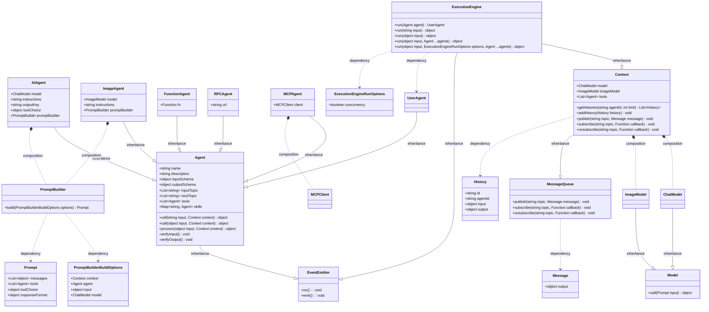

## AIGNE Framework

[](https://star-history.com/#AIGNE-io/aigne-framework)
[](https://github.com/AIGNE-io/aigne-framework/issues)
[](https://codecov.io/gh/AIGNE-io/aigne-framework)
[](https://www.npmjs.com/package/@aigne/core)
[](https://github.com/AIGNE-io/aigne-framework/blob/main/LICENSE)


## What is AIGNE Framework

AIGNE Framework is a functional AI application development framework designed to simplify and accelerate the process of building modern applications. It combines functional programming features, powerful artificial intelligence capabilities, and modular design principles to help developers easily create scalable solutions. AIGNE Framework is also deeply integrated with the Blocklet ecosystem, providing developers with a wealth of tools and resources.

## Class Definitions



## Usage

```ts
import { AIAgent, ChatModelOpenAI, ExecutionEngine } from "@aigne/core";
import { DEFAULT_CHAT_MODEL, OPENAI_API_KEY } from "../env";

const model = new ChatModelOpenAI({
  apiKey: OPENAI_API_KEY,
  model: DEFAULT_CHAT_MODEL,
});

function transferToAgentB() {
  return agentB;
}

function transferToAgentA() {
  return agentA;
}

const agentA = AIAgent.from({
  name: "AgentA",
  instructions: "You are a helpful agent.",
  outputKey: "A",
  tools: [transferToAgentB],
});

const agentB = AIAgent.from({
  name: "AgentB",
  instructions: "Only speak in Haikus.",
  outputKey: "B",
  tools: [transferToAgentA],
});

const engine = new ExecutionEngine({ model });

const userAgent = await engine.run(agentA);

const response = await userAgent.run("transfer to agent b");
// output
// {
//   B: "Agent B awaits here,  \nIn haikus I shall speak now,  \nWhat do you seek, friend?",
// }
```

## Packages

- [examples/agents](./examples/agents) - Example project demonstrating how to use different agents to handle various tasks.
- [packages/core](./packages/core) - Core package providing the foundation for building AIGNE applications.
- [packages/memory](./packages/memory) - Memory package providing memory storage capabilities for AIGNE applications.
- [packages/runtime](./packages/runtime) - Runtime package providing runtime capabilities for AIGNE applications.

## Key Features

### Core Capabilities

- **Modular Design**: With a clear modular structure, developers can easily organize code, improve development efficiency, and simplify maintenance.
- **TypeScript Support**: Comprehensive TypeScript type definitions are provided, ensuring type safety and enhancing the developer experience.
- **Blocklet Ecosystem Integration**: Closely integrated with the Blocklet ecosystem, providing developers with a one-stop solution for development and deployment.

### AI Capabilities

- **Intelligent Generation**: Built-in various AI models support advanced features such as natural language processing and image recognition, helping developers build intelligent applications.
- **Developer-Friendly**: Provides simple APIs and tools, lowering the barrier to using AI technology.

### Blocklet Ecosystem

- **Rich Ecosystem Resources**: Deep integration with Blocklet Store allows developers to easily access various components and templates.
- **Rapid Deployment**: Through the Blocklet platform, applications can be quickly launched and globally distributed.
- **Strong Community Support**: An active developer community provides continuous resources and technical support.

## Use Cases

- **Intelligent Chat Applications**: Quickly develop chatbot that support natural language interaction based on built-in AI models.
- **Dynamic Content Generation**: Use AI capabilities to generate personalized content and enhance user experience.
- **Blockchain Applications**: Seamlessly integrated with the Blocklet ecosystem, AIGNE Framework supports the development of decentralized applications (DApps).

## Getting Started

- Build your first AIGNE application
  - Develop native JavaScript applications with AIGNE
  - Develop Blocklet ecosystem applications with AIGNE
- Define and run Agents

## Community and Support

AIGNE Framework has a vibrant developer community offering various support channels:

[Documentation Center](https://www.arcblock.io/docs/aigne-framework/introduce): Comprehensive official documentation to help developers get started quickly.
[Technical Forum](https://community.arcblock.io/discussions/boards/aigne): Exchange experiences with global developers and solve technical problems.
