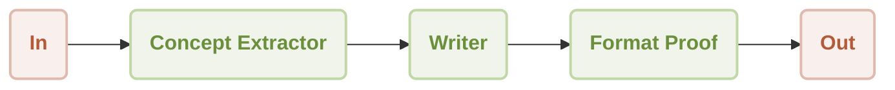
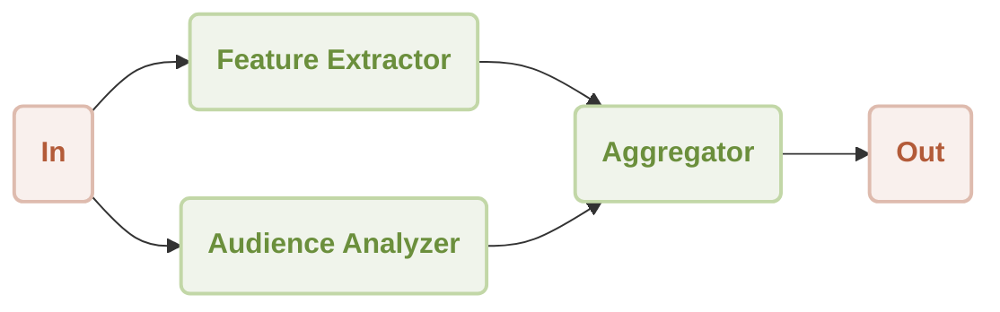
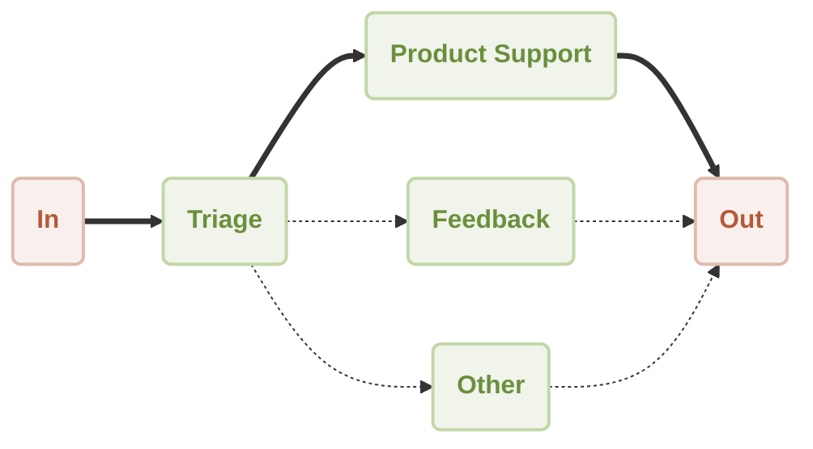
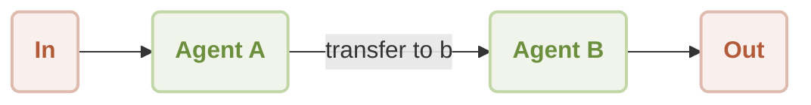
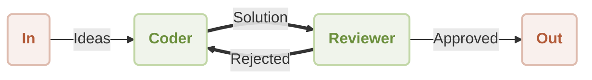
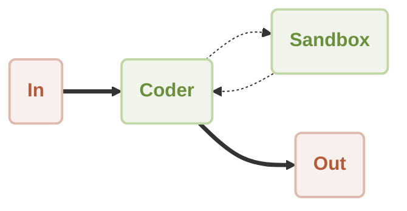

[English](./README.md) | [中文](./README.zh.md)

[](https://star-history.com/#AIGNE-io/aigne-framework)
[](https://github.com/AIGNE-io/aigne-framework/issues)
[](https://codecov.io/gh/AIGNE-io/aigne-framework)
[](https://www.npmjs.com/package/@aigne/core)
[](https://github.com/AIGNE-io/aigne-framework/blob/main/LICENSE)

## What is AIGNE Framework

AIGNE Framework is a functional AI application development framework designed to simplify and accelerate the process of building modern applications. It combines functional programming features, powerful artificial intelligence capabilities, and modular design principles to help developers easily create scalable solutions. AIGNE Framework is also deeply integrated with the Blocklet ecosystem, providing developers with a wealth of tools and resources.

## Key Features

- **Modular Design**: With a clear modular structure, developers can easily organize code, improve development efficiency, and simplify maintenance.
- **TypeScript Support**: Comprehensive TypeScript type definitions are provided, ensuring type safety and enhancing the developer experience.
- **Multiple AI Model Support**: Built-in support for OpenAI, Gemini, Claude and other mainstream AI models, easily extensible to support additional models.
- **Flexible Workflow Patterns**: Support for sequential, concurrent, routing, handoff and other workflow patterns to meet various complex application requirements.
- **MCP Protocol Integration**: Seamless integration with external systems and services through the Model Context Protocol.
- **Code Execution Capabilities**: Support for executing dynamically generated code in a secure sandbox, enabling more powerful automation capabilities.
- **Blocklet Ecosystem Integration**: Closely integrated with the Blocklet ecosystem, providing developers with a one-stop solution for development and deployment.

## Quick Start

### Installation

```bash
# Using npm
npm install @aigne/core

# Using yarn
yarn add @aigne/core

# Using pnpm
pnpm add @aigne/core
```

### Usage Example

```ts
import { AIAgent, ExecutionEngine } from "@aigne/core";
import { OpenAIChatModel } from "@aigne/core/models/openai-chat-model.js";

const model = new OpenAIChatModel({
  apiKey: process.env.OPENAI_API_KEY,
  model: process.env.DEFAULT_CHAT_MODEL || "gpt-4-turbo",
});

function transferToAgentB() {
  return agentB;
}

function transferToAgentA() {
  return agentA;
}

const agentA = AIAgent.from({
  name: "AgentA",
  instructions: "You are a helpful agent.",
  outputKey: "A",
  tools: [transferToAgentB],
});

const agentB = AIAgent.from({
  name: "AgentB",
  instructions: "Only speak in Haikus.",
  outputKey: "B",
  tools: [transferToAgentA],
});

const engine = new ExecutionEngine({ model });

const userAgent = await engine.call(agentA);

const response = await userAgent.call("transfer to agent b");
// output
// {
//   B: "Agent B awaits here,  \nIn haikus I shall speak now,  \nWhat do you seek, friend?",
// }
```

## Packages

- [examples](./examples) - Example project demonstrating how to use different agents to handle various tasks.
- [packages/core](./packages/core) - Core package providing the foundation for building AIGNE applications.

## Documentation

- [CLI Guide](./docs/cli.md) ([中文](./docs/cli.zh.md)): Comprehensive guide to the AIGNE CLI tool
- [Agent Development Guide](./docs/agent-development.md) ([中文](./docs/agent-development.zh.md)): Guide to developing AIGNE agents using YAML/JS configuration files
- [Cookbook](./docs/cookbook.md) ([中文](./docs/cookbook.zh.md)): Practical recipes and patterns for AIGNE Framework API usage
- API References:
  - [Agent API](./docs/apis/agent-api.md) ([English](./docs/apis/agent-api.md) | [中文](./docs/apis/agent-api.zh.md))
  - [AI Agent API](./docs/apis/ai-agent-api.md) ([English](./docs/apis/ai-agent-api.md) | [中文](./docs/apis/ai-agent-api.zh.md))
  - [Function Agent API](./docs/apis/function-agent-api.md) ([English](./docs/apis/function-agent-api.md) | [中文](./docs/apis/function-agent-api.zh.md))
  - [MCP Agent API](./docs/apis/mcp-agent-api.md) ([English](./docs/apis/mcp-agent-api.md) | [中文](./docs/apis/mcp-agent-api.zh.md))
  - [Execution Engine API](./docs/apis/execution-engine-api.md) ([English](./docs/apis/execution-engine-api.md) | [中文](./docs/apis/execution-engine-api.zh.md))

## Architecture

AIGNE Framework supports various workflow patterns to address different AI application needs. Each workflow pattern is optimized for specific use cases:

### Sequential Workflow

**Use Cases**: Processing multi-step tasks that require a specific execution order, such as content generation pipelines, multi-stage data processing, etc.



### Concurrency Workflow

**Use Cases**: Scenarios requiring simultaneous processing of multiple independent tasks to improve efficiency, such as parallel data analysis, multi-dimensional content evaluation, etc.



### Router Workflow

**Use Cases**: Scenarios where requests need to be routed to different specialized processors based on input content type, such as intelligent customer service systems, multi-functional assistants, etc.



### Handoff Workflow

**Use Cases**: Scenarios requiring control transfer between different specialized agents to solve complex problems, such as expert collaboration systems, etc.



### Reflection Workflow

**Use Cases**: Scenarios requiring self-assessment and iterative improvement of output quality, such as code reviews, content quality control, etc.



### Code Execution Workflow

**Use Cases**: Scenarios requiring dynamically generated code execution to solve problems, such as automated data analysis, algorithmic problem solving, etc.



## Examples

### MCP Server Integration

- [Puppeteer MCP Server](./examples/mcp-puppeteer) - Learn how to leverage Puppeteer for automated web scraping through the AIGNE Framework.
- [SQLite MCP Server](./examples/mcp-sqlite) - Explore database operations by connecting to SQLite through the Model Context Protocol.
- [Github](./examples/mcp-github) - Interact with GitHub repositories using the GitHub MCP Server.

### Workflow Patterns

- [Workflow Router](./examples/workflow-router) - Implement intelligent routing logic to direct requests to appropriate handlers based on content.
- [Workflow Sequential](./examples/workflow-sequential) - Build step-by-step processing pipelines with guaranteed execution order.
- [Workflow Concurrency](./examples/workflow-concurrency) - Optimize performance by processing multiple tasks simultaneously with parallel execution.
- [Workflow Handoff](./examples/workflow-handoff) - Create seamless transitions between specialized agents to solve complex problems.
- [Workflow Reflection](./examples/workflow-reflection) - Enable self-improvement through output evaluation and refinement capabilities.
- [Workflow Orchestration](./examples/workflow-orchestration) - Coordinate multiple agents working together in sophisticated processing pipelines.
- [Workflow Code Execution](./examples/workflow-code-execution) - Safely execute dynamically generated code within AI-driven workflows.
- [Workflow Group Chat](./examples/workflow-group-chat) - Share messages and interact with multiple agents in a group chat environment.

## Contributing and Releasing

AIGNE Framework is an open source project and welcomes community contributions. We use [release-please](https://github.com/googleapis/release-please) for version management and release automation.

- Contributing Guidelines: See [CONTRIBUTING.md](./CONTRIBUTING.md)
- Release Process: See [RELEASING.md](./RELEASING.md)

## License

This project is licensed under the [Elastic-2.0](./LICENSE) - see the [LICENSE](./LICENSE) file for details.

## Community and Support

AIGNE Framework has a vibrant developer community offering various support channels:

- [Documentation Center](https://www.arcblock.io/docs/aigne-framework/introduce): Comprehensive official documentation to help developers get started quickly.
- [Technical Forum](https://community.arcblock.io/discussions/boards/aigne): Exchange experiences with global developers and solve technical problems.
