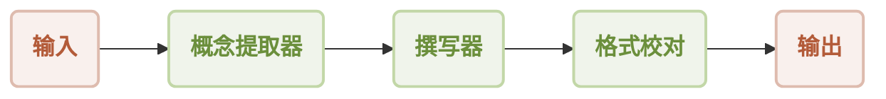
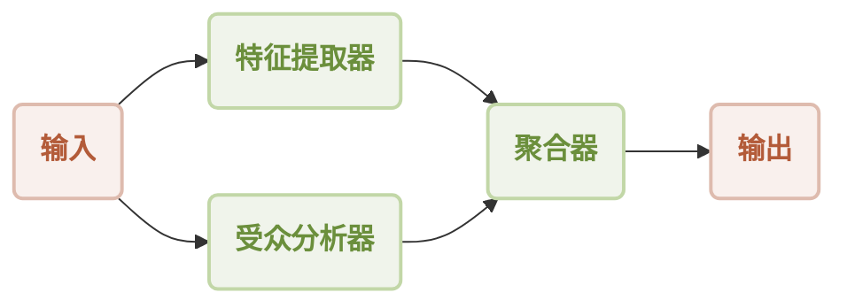
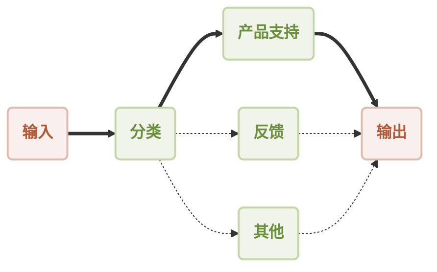
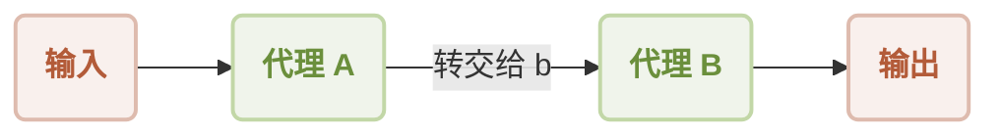
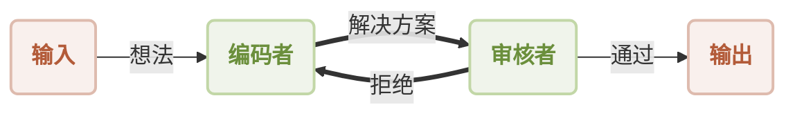
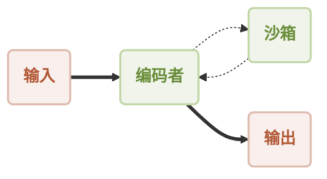
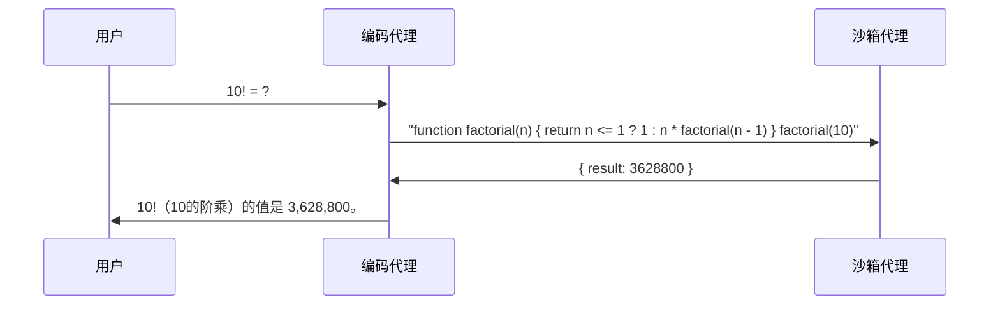

# AIGNE Framework

[English](./README.md) | [中文](./README.zh.md)

[](https://star-history.com/#AIGNE-io/aigne-framework)
[](https://github.com/AIGNE-io/aigne-framework/issues)
[](https://codecov.io/gh/AIGNE-io/aigne-framework)
[](https://www.npmjs.com/package/@aigne/core-next)
[](https://github.com/AIGNE-io/aigne-framework/blob/main/LICENSE)

## AIGNE Framework 简介

AIGNE Framework 是一个功能型 AI 应用开发框架，旨在简化和加速现代应用程序的构建过程。它结合了函数式编程特性、强大的人工智能能力和模块化设计原则，帮助开发者轻松创建可扩展的解决方案。AIGNE Framework 还深度集成了 Blocklet 生态系统，为开发者提供丰富的工具和资源。

## 核心特性

- **模块化设计**：采用清晰的模块化结构，开发者可以轻松组织代码，提高开发效率，简化维护工作。
- **TypeScript 支持**：提供全面的 TypeScript 类型定义，确保类型安全并增强开发体验。
- **Blocklet 生态系统集成**：与 Blocklet 生态系统紧密集成，为开发者提供一站式开发和部署解决方案。

## 使用示例

```ts
import { AIAgent, OpenAIChatModel, ExecutionEngine } from "@aigne/core-next";
import { DEFAULT_CHAT_MODEL, OPENAI_API_KEY } from "../env";

const model = new OpenAIChatModel({
  apiKey: OPENAI_API_KEY,
  model: DEFAULT_CHAT_MODEL,
});

function transferToAgentB() {
  return agentB;
}

function transferToAgentA() {
  return agentA;
}

const agentA = AIAgent.from({
  name: "AgentA",
  instructions: "You are a helpful agent.",
  outputKey: "A",
  tools: [transferToAgentB],
});

const agentB = AIAgent.from({
  name: "AgentB",
  instructions: "Only speak in Haikus.",
  outputKey: "B",
  tools: [transferToAgentA],
});

const engine = new ExecutionEngine({ model });

const userAgent = await engine.call(agentA);

const response = await userAgent.call("transfer to agent b");
// 输出
// {
//   B: "Agent B awaits here,  \nIn haikus I shall speak now,  \nWhat do you seek, friend?",
// }
```

## 包结构

- [examples](./examples) - 示例项目，演示如何使用不同的代理处理各种任务。
- [packages/core](./packages/core) - 核心包，为构建 AIGNE 应用程序提供基础。

## 文档

- [Cookbook](./docs/cookbook.md) ([中文](./docs/cookbook.zh.md)): AIGNE Framework 常见使用场景的实用方案和模式
- API 参考:
  - [Agent API](./docs/apis/agent-api.md) ([English](./docs/apis/agent-api.en.md) | [中文](./docs/apis/agent-api.zh.md))
  - [AI Agent API](./docs/apis/ai-agent-api.md) ([English](./docs/apis/ai-agent-api.en.md) | [中文](./docs/apis/ai-agent-api.zh.md))
  - [Function Agent API](./docs/apis/function-agent-api.md) ([English](./docs/apis/function-agent-api.en.md) | [中文](./docs/apis/function-agent-api.zh.md))
  - [MCP Agent API](./docs/apis/mcp-agent-api.md) ([English](./docs/apis/mcp-agent-api.en.md) | [中文](./docs/apis/mcp-agent-api.zh.md))
  - [Execution Engine API](./docs/apis/execution-engine-api.md) ([English](./docs/apis/execution-engine-api.en.md) | [中文](./docs/apis/execution-engine-api.zh.md))

## 架构

AIGNE Framework 支持多种工作流模式，以满足不同 AI 应用需求：

### 顺序工作流



### 并发工作流



### 路由工作流



### 交接工作流



### 反思工作流



### 代码执行工作流



代码执行工作流交互序列：



## 示例

### MCP 服务器集成

- [Puppeteer MCP Server](./examples/mcp-server-puppeteer) - 学习如何通过 AIGNE Framework 利用 Puppeteer 进行自动化网页抓取。
- [SQLite MCP Server](./examples/mcp-server-sqlite) - 探索通过模型上下文协议连接 SQLite 进行数据库操作。

### 工作流模式

- [Workflow Router](./examples/workflow-router) - 实现智能路由逻辑，根据内容将请求定向到适当的处理程序。
- [Workflow Sequential](./examples/workflow-sequential) - 构建具有保证执行顺序的步骤式处理管道。
- [Workflow Concurrency](./examples/workflow-concurrency) - 通过并行执行同时处理多个任务优化性能。
- [Workflow Handoff](./examples/workflow-handoff) - 在专业代理之间创建无缝转换以解决复杂问题。
- [Workflow Reflection](./examples/workflow-reflection) - 通过输出评估和修正能力实现自我提升。
- [Workflow Orchestration](./examples/workflow-orchestration) - 协调多个代理在复杂处理管道中共同工作。
- [Workflow Code Execution](./examples/workflow-code-execution) - 在 AI 驱动的工作流中安全执行动态生成的代码。
- [Workflow Group Chat](./examples/workflow-group-chat) - 通过聊天模型实现群聊功能，支持多个用户同时参与。

## 贡献与发布

AIGNE Framework 使用 [release-please](https://github.com/googleapis/release-please) 进行版本管理和发布自动化。有关发布流程和贡献指南的详细信息，请参阅 [RELEASING.zh.md](./RELEASING.zh.md) 和 [CONTRIBUTING.md](./CONTRIBUTING.md)。

## 社区与支持

AIGNE Framework 拥有活跃的开发者社区，提供多种支持渠道：

- [文档中心](https://www.arcblock.io/docs/aigne-framework/introduce)：全面的官方文档，帮助开发者快速入门。
- [技术论坛](https://community.arcblock.io/discussions/boards/aigne)：与全球开发者交流经验，解决技术问题。
