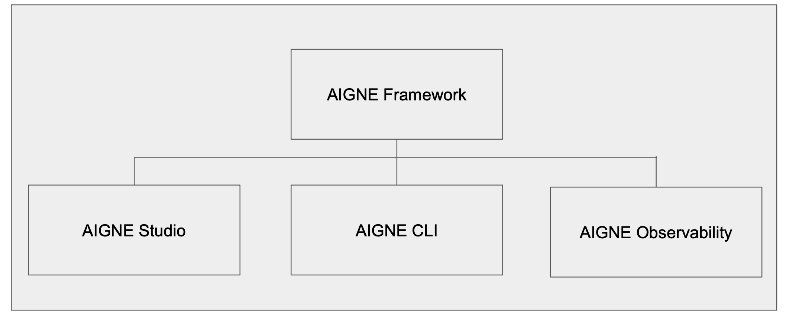
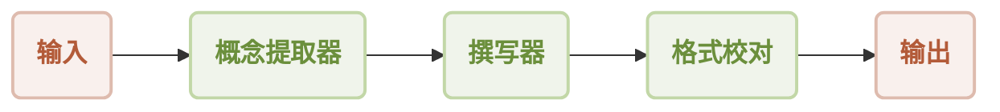
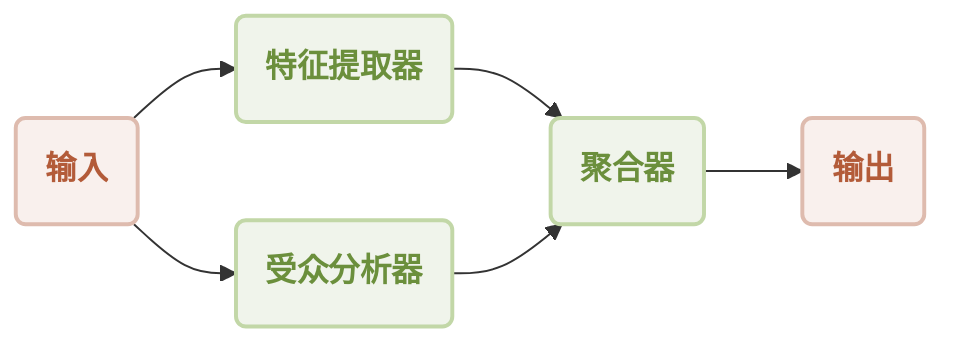
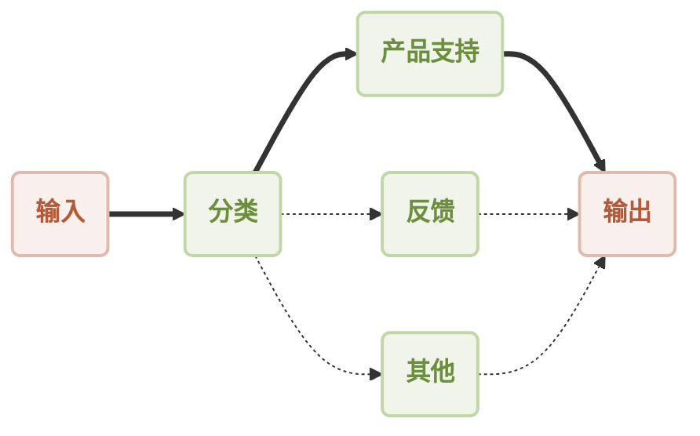
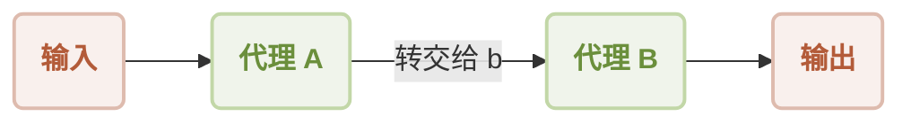
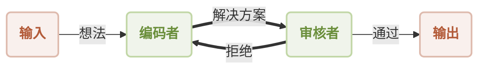
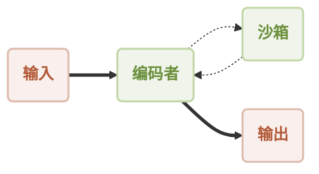
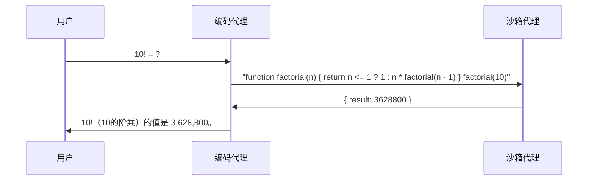

<p align="center">
  
</p>

<p align="center">
  🇬🇧 <a href="./README.md">English</a> | 🇨🇳 <a href="./README.zh.md">中文</a>
</p>

[](https://star-history.com/#AIGNE-io/aigne-framework)
[](https://github.com/AIGNE-io/aigne-framework/issues)
[](https://codecov.io/gh/AIGNE-io/aigne-framework)
[](https://www.npmjs.com/package/@aigne/core)
[](https://github.com/AIGNE-io/aigne-framework/blob/main/LICENSE.md)

## AIGNE Framework 简介

AIGNE Framework 是一个功能型 AI 应用开发框架，旨在简化和加速现代应用程序的构建过程。它结合了函数式编程特性、强大的人工智能能力和模块化设计原则，帮助开发者轻松创建可扩展的解决方案。AIGNE Framework 还深度集成了 Blocklet 生态系统，为开发者提供丰富的工具和资源。

## 架构



## 核心特性

* **模块化设计**：采用清晰的模块化结构，开发者可以轻松组织代码，提高开发效率，简化维护工作。
* **TypeScript 支持**：提供全面的 TypeScript 类型定义，确保类型安全并增强开发体验。
* **多种 AI 模型支持**：内置支持 OpenAI、Gemini、Claude、Nova 等主流 AI 模型，可轻松扩展支持其他模型。
* **灵活的工作流模式**：支持顺序、并发、路由、交接等多种工作流模式，满足各种复杂应用场景需求。
* **MCP 协议集成**：通过模型上下文协议（Model Context Protocol）支持与外部系统和服务的无缝集成。
* **代码执行能力**：支持在安全沙箱中执行动态生成的代码，实现更强大的自动化能力。
* **Blocklet 生态系统集成**：与 Blocklet 生态系统紧密集成，为开发者提供一站式开发和部署解决方案。

## 快速开始

### 环境要求

* Node.js 版本 20.0 或更高

### 安装

#### 使用 npm

```bash
npm install @aigne/core
```

#### 使用 yarn

```bash
yarn add @aigne/core
```

#### 使用 pnpm

```bash
pnpm add @aigne/core
```

### 使用示例

```ts file="/examples/workflow-handoff/usages.ts"
import { AIAgent, AIGNE } from "@aigne/core";
import { OpenAIChatModel } from "@aigne/openai";

const { OPENAI_API_KEY } = process.env;

const model = new OpenAIChatModel({
  apiKey: OPENAI_API_KEY,
});

function transferToB() {
  return agentB;
}

const agentA = AIAgent.from({
  name: "AgentA",
  instructions: "You are a helpful agent.",
  outputKey: "A",
  skills: [transferToB],
  inputKey: "message",
});

const agentB = AIAgent.from({
  name: "AgentB",
  instructions: "Only speak in Haikus.",
  outputKey: "B",
  inputKey: "message",
});

const aigne = new AIGNE({ model });

const userAgent = aigne.invoke(agentA);

const result1 = await userAgent.invoke({ message: "transfer to agent b" });
console.log(result1);
// Output:
// {
//   B: "Transfer now complete,  \nAgent B is here to help.  \nWhat do you need, friend?",
// }

const result2 = await userAgent.invoke({ message: "It's a beautiful day" });
console.log(result2);
// Output:
// {
//   B: "Sunshine warms the earth,  \nGentle breeze whispers softly,  \nNature sings with joy.  ",
// }
```

## 包结构

* [examples](./examples) - 示例项目，演示如何使用不同的代理处理各种任务。
* [packages/core](./packages/core) - 核心包，为构建 AIGNE 应用程序提供基础。
* [packages/agent-library](./packages/agent-library) - 提供多种代理实现，简化代理的创建和管理。
* [packages/cli](./packages/cli) - 命令行工具，提供便捷的命令行界面，简化开发和调试过程。
* models - 大语言模型的实现，支持多种模型和 API
  * [models/openai](./models/openai) - OpenAI 模型的实现，支持 OpenAI 的 API 和函数调用。
  * [models/anthropic](./models/anthropic) - Anthropic 模型的实现，支持 Anthropic 的 API 和函数调用。
  * [models/bedrock](./models/bedrock) - Bedrock 模型的实现，支持 Bedrock 的 API 和函数调用。
  * [models/deepseek](./models/deepseek) - DeepSeek 模型的实现，支持 DeepSeek 的 API 和函数调用。
  * [models/gemini](./models/gemini) - Gemini 模型的实现，支持 Gemini 的 API 和函数调用。
  * [models/ollama](./models/ollama) - Ollama 模型的实现，支持 Ollama 的 API 和函数调用。
  * [models/open-router](./models/open-router) - OpenRouter 模型的实现，支持 OpenRouter 的 API 和函数调用。
  * [models/xai](./models/xai) - XAI 模型的实现，支持 XAI 的 API 和函数调用。

## 文档

[AIGNE Framework 文档](https://www.arcblock.io/docs/aigne-framework) 提供了全面的 API 参考和使用指南，帮助开发者快速上手。

## 架构

AIGNE Framework 支持多种工作流模式，以满足不同 AI 应用需求。每种工作流模式都针对特定的应用场景进行了优化：

### 顺序工作流（Sequential Workflow）

**适用场景**：处理需要按特定顺序执行的多步骤任务，如内容生成管道、多阶段数据处理等。



### 并发工作流（Concurrent Workflow）

**适用场景**：需要同时处理多个独立任务以提高效率的场景，如并行数据分析、多维度内容评估等。



### 路由工作流（Router Workflow）

**适用场景**：根据输入内容类型将请求路由到不同专业处理器的场景，如智能客服系统、多功能助手等。



### 交接工作流（Handoff Workflow）

**适用场景**：需要在不同专业代理之间传递控制权以解决复杂问题的场景，如专家协作系统等。



### 反思工作流（Reflection Workflow）

**适用场景**：需要自我评估和迭代改进输出质量的场景，如代码审查、内容质量控制等。



### 代码执行工作流（Code Execution Workflow）

**适用场景**：需要动态生成并执行代码来解决问题的场景，如自动化数据分析、算法问题求解等。



代码执行工作流交互序列：



## 示例

### MCP 服务器集成

* [MCP Server](./examples/mcp-server) - 使用 AIGNE CLI 构建 MCP 服务器，对外提供 MCP 服务。
* [Puppeteer MCP Server](./examples/mcp-puppeteer) - 学习如何通过 AIGNE Framework 利用 Puppeteer 进行自动化网页抓取。
* [SQLite MCP Server](./examples/mcp-sqlite) - 探索通过模型上下文协议连接 SQLite 进行数据库操作。
* [Github](./examples/mcp-github) - 了解如何使用 AIGNE Framework 和 GitHub MCP 服务器与 GitHub 仓库进行交互。

### 工作流模式

* [Workflow Router](./examples/workflow-router) - 实现智能路由逻辑，根据内容将请求定向到适当的处理程序。
* [Workflow Sequential](./examples/workflow-sequential) - 构建具有保证执行顺序的步骤式处理管道。
* [Workflow Concurrency](./examples/workflow-concurrency) - 通过并行执行同时处理多个任务优化性能。
* [Workflow Handoff](./examples/workflow-handoff) - 在专业代理之间创建无缝转换以解决复杂问题。
* [Workflow Reflection](./examples/workflow-reflection) - 通过输出评估和修正能力实现自我提升。
* [Workflow Orchestration](./examples/workflow-orchestration) - 协调多个代理在复杂处理管道中共同工作。
* [Workflow Code Execution](./examples/workflow-code-execution) - 在 AI 驱动的工作流中安全执行动态生成的代码。
* [Workflow Group Chat](./examples/workflow-group-chat) - 通过聊天模型实现群聊功能，支持多个用户同时参与。

## 贡献与发布

AIGNE Framework 是一个开源项目，欢迎社区贡献。我们使用 [release-please](https://github.com/googleapis/release-please) 进行版本管理和发布自动化。

* 贡献指南：请参阅 [CONTRIBUTING.md](./CONTRIBUTING.md)
* 发布流程：请参阅 [RELEASING.zh.md](./RELEASING.zh.md)

## 许可证

本项目采用 [Elastic-2.0](./LICENSE.md) 授权 - 详情请查看 [LICENSE](./LICENSE.md) 文件。

## 社区与支持

AIGNE Framework 拥有活跃的开发者社区，提供多种支持渠道：

* [文档中心](https://www.arcblock.io/docs/aigne-framework)：全面的官方文档，帮助开发者快速入门。
* [技术论坛](https://community.arcblock.io/discussions/boards/aigne)：与全球开发者交流经验，解决技术问题。
