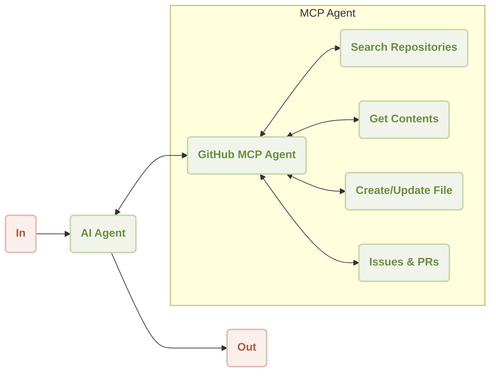
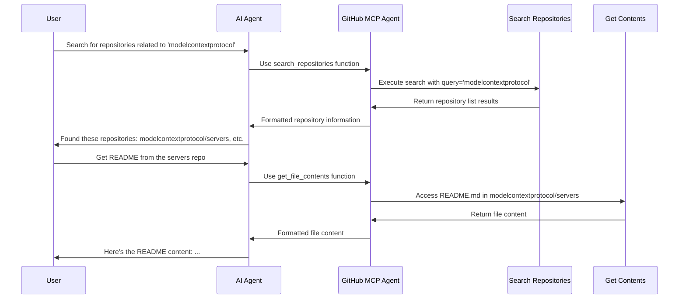

# GitHub MCP Server Integration

This is a demonstration of using [AIGNE Framework](https://github.com/AIGNE-io/aigne-framework) and [GitHub MCP Server](https://github.com/modelcontextprotocol/servers/tree/main/src/github) to interact with GitHub repositories.



Following is a sequence diagram of the workflow to search for repositories and access contents:



## Prerequisites

- [Node.js](https://nodejs.org) and npm installed on your machine
- [OpenAI API key](https://platform.openai.com/api-keys) used to interact with OpenAI API
- [GitHub Personal Access Token](https://github.com/settings/tokens) with appropriate permissions
- [Pnpm](https://pnpm.io) [Optional] if you want to run the example from source code

## Try without Installation

```bash
export OPENAI_API_KEY=YOUR_OPENAI_API_KEY # Setup your OpenAI API key
export GITHUB_PERSONAL_ACCESS_TOKEN=YOUR_GITHUB_TOKEN # Setup your GitHub token

npx -y @aigne/example-mcp-server-github # Run the example
```

## Installation

### Clone the Repository

```bash
git clone https://github.com/AIGNE-io/aigne-framework
```

### Install Dependencies

```bash
cd aigne-framework/examples/mcp-server-github-integrator

pnpm install
```

### Setup Environment Variables

Setup your API keys in the `.env.local` file:

```bash
OPENAI_API_KEY="" # Your OpenAI API key
GITHUB_PERSONAL_ACCESS_TOKEN="" # Your GitHub Personal Access Token
```

### Run the Example

```bash
pnpm start # Interactive chat interface
# or
pnpm example # Run predefined examples
```

## Example

The following example demonstrates how to use the GitHub MCP server to search for repositories:

```typescript
import {
  AIAgent,
  ChatModelOpenAI,
  ExecutionEngine,
  MCPAgent,
} from "@aigne/core-next";

// Load environment variables
const { OPENAI_API_KEY, GITHUB_PERSONAL_ACCESS_TOKEN } = process.env;

// Initialize OpenAI model
const model = new ChatModelOpenAI({
  apiKey: OPENAI_API_KEY,
});

// Initialize GitHub MCP agent
const githubMCPAgent = await MCPAgent.from({
  command: "npx",
  args: ["-y", "@modelcontextprotocol/server-github"],
  env: {
    GITHUB_PERSONAL_ACCESS_TOKEN,
  },
});

// Create execution engine
const engine = new ExecutionEngine({
  model,
  tools: [githubMCPAgent],
});

// Create AI agent with GitHub-specific instructions
const agent = AIAgent.from({
  instructions: `\
## GitHub Interaction Assistant
You are an assistant that helps users interact with GitHub repositories.
You can perform various GitHub operations like:
1. Searching repositories
2. Getting file contents
3. Creating or updating files
4. Creating issues and pull requests
5. And many more GitHub operations

Always provide clear, concise responses with relevant information from GitHub.
`,
});

// Example: Search for repositories
const result = await engine.run(
  "Search for repositories related to 'modelcontextprotocol'",
  agent
);

console.log(result.text);
// Output:
// I found several repositories related to 'modelcontextprotocol':
//
// 1. **modelcontextprotocol/servers** - MCP servers for various APIs and services
// 2. **modelcontextprotocol/modelcontextprotocol** - The main ModelContextProtocol repository
// ...

// Shutdown the engine when done
await engine.shutdown();
```

## Available GitHub Operations

The GitHub MCP server provides a wide range of operations including:

1. **Repository Operations**:

   - Search repositories
   - Create repositories
   - Get repository information

2. **File Operations**:

   - Get file contents
   - Create or update files
   - Push multiple files in a single commit

3. **Issue and PR Operations**:

   - Create issues
   - Create pull requests
   - Add comments
   - Merge pull requests

4. **Search Operations**:

   - Search code
   - Search issues
   - Search users

5. **Commit Operations**:
   - List commits
   - Get commit details

## License

This project is licensed under the MIT License.
