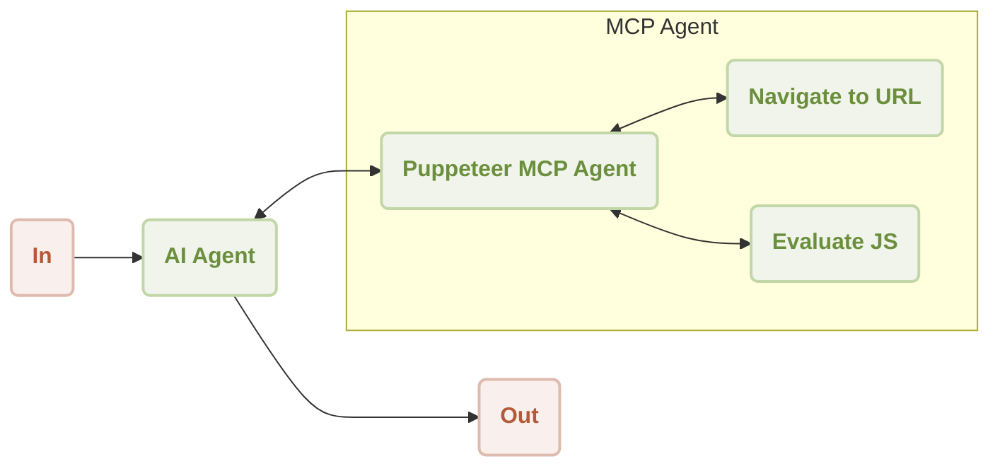
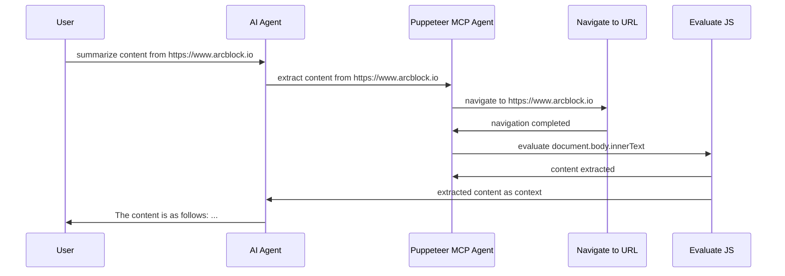

# Puppeteer MCP Server Demo

This is a demonstration of using [AIGNE Framework](https://github.com/AIGNE-io/aigne-framework) and [Puppeteer MCP Server](https://github.com/modelcontextprotocol/servers/tree/8bd41eb0b3cf48aea0d1fe5b6c7029736092dcb1/src/puppeteer) to extract content from websites using Puppeteer.



Following is a sequence diagram of the workflow to summarize content from a website:




## Prerequisites

- [Node.js](https://nodejs.org) and npm installed on your machine
- [OpenAI API key](https://platform.openai.com/api-keys) used to interact with OpenAI API
- [Pnpm](https://pnpm.io) [Optional] if you want to run the example from source code

## Try without Installation

```bash
export OPENAI_API_KEY=YOUR_OPENAI_API_KEY # setup your OpenAI API key

npx -y @aigne/example-mcp-server-puppeteer # run the example
```

## Installation

### Clone the Repository

```bash
git clone https://github.com/AIGNE-io/aigne-framework
```

### Install Dependencies

```bash
cd aigne-framework/examples/mcp-server-puppeteer

pnpm install
```

### Setup Environment Variables

Setup your OpenAI API key in the `.env.local` file:

```bash
OPENAI_API_KEY="" # setup your OpenAI API key here
```

### Run the Example

```bash
pnpm start
```

## Example

The following example demonstrates how to extract content from a website:

```typescript
import assert from "node:assert";
import { AIAgent, OpenAIChatModel, ExecutionEngine, MCPAgent } from "@aigne/core-next";

const { OPENAI_API_KEY } = process.env;
assert(OPENAI_API_KEY, "Please set the OPENAI_API_KEY environment variable");

const model = new OpenAIChatModel({
  apiKey: OPENAI_API_KEY,
});

const puppeteerMCPAgent = await MCPAgent.from({
  command: "npx",
  args: ["-y", "@modelcontextprotocol/server-puppeteer"],
});

const engine = new ExecutionEngine({
  model,
  tools: [puppeteerMCPAgent],
});

const agent = AIAgent.from({
  instructions: `\
## Steps to extract content from a website
1. navigate to the url
2. evaluate document.body.innerText to get the content
`,
});

const result = await engine.call(agent, "extract content from https://www.arcblock.io");

console.log(result);
// output:
// {
//   $message: "The content extracted from the website [ArcBlock](https://www.arcblock.io) is as follows:\n\n---\n\n**Redefining Software Architect and Ecosystems**\n\nA total solution for building decentralized applications ...",
// }

await engine.shutdown();
```

## License

This project is licensed under the MIT License.
