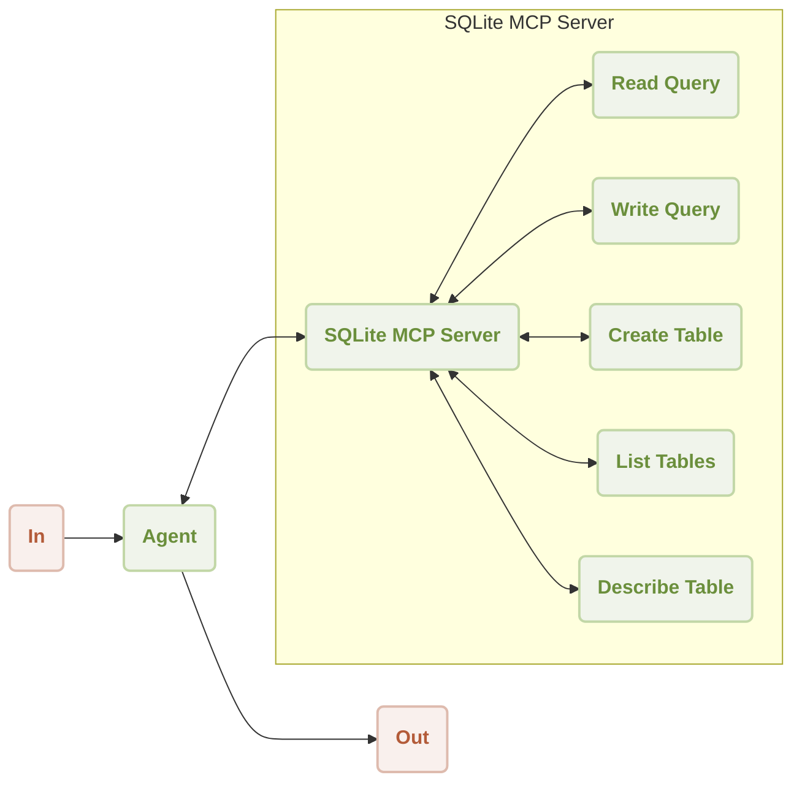
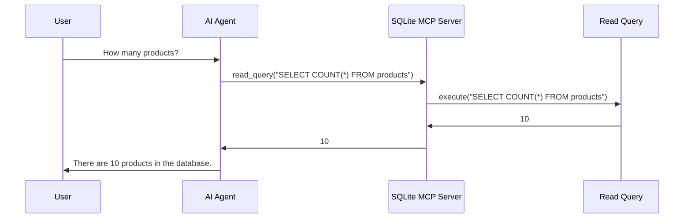

# Sqlite MCP Server Demo

This is a demonstration of using [AIGNE Framework](https://github.com/AIGNE-io/aigne-framework) and [MCP Server SQlite](https://github.com/modelcontextprotocol/servers/tree/main/src/sqlite) to interact with SQLite databases.



Following is a sequence diagram of the workflow to interact with an SQLite database:



## Prerequisites

- [Node.js](https://nodejs.org) and npm installed on your machine
- [Bun](https://bun.sh) installed on your machine
- [OpenAI API key](https://platform.openai.com/api-keys) used to interact with OpenAI API
- [uv](https://github.com/astral-sh/uv) python environment for running [MCP Server SQlite](https://github.com/modelcontextprotocol/servers/tree/main/src/sqlite)
- [Pnpm](https://pnpm.io) [Optional] if you want to run the example from source code

## Try without Installation

```bash
export OPENAI_API_KEY=YOUR_OPENAI_API_KEY # setup your OpenAI API key

npx -y @aigne/example-mcp-sqlite # run the example
```

## Installation

### Clone the Repository

```bash
git clone https://github.com/AIGNE-io/aigne-framework
```

### Install Dependencies

```bash
cd aigne-framework/examples/mcp-sqlite

pnpm install
```

### Setup Environment Variables

Setup your OpenAI API key in the `.env.local` file:

```bash
OPENAI_API_KEY="" # setup your OpenAI API key here
```

### Run the Example

```bash
pnpm start
```

## Example

The following example demonstrates how to interact with an SQLite database:

```typescript
import assert from "node:assert";
import { join } from "node:path";
import { AIAgent, ExecutionEngine, MCPAgent } from "@aigne/core";
import { OpenAIChatModel } from "@aigne/core/models/openai-chat-model.js";

const { OPENAI_API_KEY } = process.env;
assert(OPENAI_API_KEY, "Please set the OPENAI_API_KEY environment variable");

const model = new OpenAIChatModel({
  apiKey: OPENAI_API_KEY,
});

const sqlite = await MCPAgent.from({
  command: "uvx",
  args: ["-q", "mcp-server-sqlite", "--db-path", join(process.cwd(), "usages.db")],
});

const engine = new ExecutionEngine({
  model,
  tools: [sqlite],
});

const agent = AIAgent.from({
  instructions: "You are a database administrator",
});

console.log(
  await engine.call(agent, "create a product table with columns name description and createdAt"),
);
// output:
// {
//   $message: "The product table has been created successfully with the columns: `name`, `description`, and `createdAt`.",
// }

console.log(await engine.call(agent, "create 10 products for test"));
// output:
// {
//   $message: "I have successfully created 10 test products in the database. Here are the products that were added:\n\n1. Product 1: $10.99 - Description for Product 1\n2. Product 2: $15.99 - Description for Product 2\n3. Product 3: $20.99 - Description for Product 3\n4. Product 4: $25.99 - Description for Product 4\n5. Product 5: $30.99 - Description for Product 5\n6. Product 6: $35.99 - Description for Product 6\n7. Product 7: $40.99 - Description for Product 7\n8. Product 8: $45.99 - Description for Product 8\n9. Product 9: $50.99 - Description for Product 9\n10. Product 10: $55.99 - Description for Product 10\n\nIf you need any further assistance or operations, feel free to ask!",
// }

console.log(await engine.call(agent, "how many products?"));
// output:
// {
//   $message: "There are 10 products in the database.",
// }

await engine.shutdown();
```

## License

This project is licensed under the MIT License.
