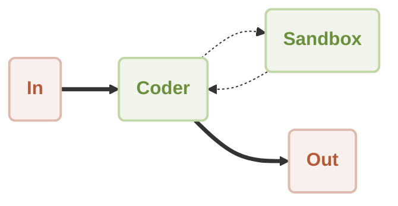
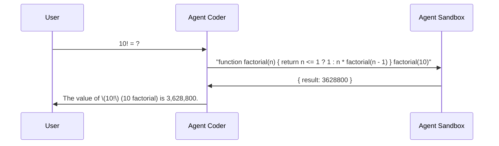

# Workflow code-execution Demo

This is a demonstration of using [AIGNE Framework](https://github.com/AIGNE-io/aigne-framework) to build a code-execution workflow.



Workflow of a code-execution between user and coder using a sandbox:




## Prerequisites

- [Node.js](https://nodejs.org) and npm installed on your machine
- [OpenAI API key](https://platform.openai.com/api-keys) used to interact with OpenAI API
- [Pnpm](https://pnpm.io) [Optional] if you want to run the example from source code

## Try without Installation

```bash
export OPENAI_API_KEY=YOUR_OPENAI_API_KEY # setup your OpenAI API key

npx -y @aigne/example-workflow-code-execution # run the example
```

## Installation

### Clone the Repository

```bash
git clone https://github.com/AIGNE-io/aigne-framework
```

### Install Dependencies

```bash
cd aigne-framework/examples/workflow-code-execution

pnpm install
```

### Setup Environment Variables

Setup your OpenAI API key in the `.env.local` file:

```bash
OPENAI_API_KEY="" # setup your OpenAI API key here
```

### Run the Example

```bash
pnpm start
```

## Example

The following example demonstrates how to build a code-execution workflow:

```typescript
import assert from "node:assert";
import { AIAgent, ExecutionEngine, FunctionAgent } from "@aigne/core";
import { OpenAIChatModel } from "@aigne/core/models/openai-chat-model.js";
import { z } from "zod";

const { OPENAI_API_KEY } = process.env;
assert(OPENAI_API_KEY, "Please set the OPENAI_API_KEY environment variable");

const model = new OpenAIChatModel({
  apiKey: OPENAI_API_KEY,
});

const sandbox = FunctionAgent.from({
  name: "js-sandbox",
  description: "A js sandbox for running javascript code",
  inputSchema: z.object({
    code: z.string().describe("The code to run"),
  }),
  fn: async (input: { code: string }) => {
    const { code } = input;
    // biome-ignore lint/security/noGlobalEval: <explanation>
    const result = eval(code);
    return { result };
  },
});

const coder = AIAgent.from({
  name: "coder",
  instructions: `\
You are a proficient coder. You write code to solve problems.
Work with the sandbox to execute your code.
`,
  tools: [sandbox],
});

const engine = new ExecutionEngine({ model });

const result = await engine.call(coder, "10! = ?");
console.log(result);
// Output:
// {
//   $message: "The value of \\(10!\\) (10 factorial) is 3,628,800.",
// }
```

## License

This project is licensed under the MIT License.
