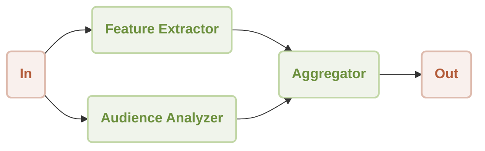

# Workflow Concurrency Demo

This is a demonstration of using [AIGNE Framework](https://github.com/AIGNE-io/aigne-framework) to build a concurrency workflow. The example now supports both one-shot and interactive chat modes, along with customizable model settings and pipeline input/output.



## Prerequisites

* [Node.js](https://nodejs.org) (>=20.0) and npm installed on your machine
* An [OpenAI API key](https://platform.openai.com/api-keys) for interacting with OpenAI's services
* Optional dependencies (if running the example from source code):
  * [Bun](https://bun.sh) for running unit tests & examples
  * [Pnpm](https://pnpm.io) for package management

## Quick Start (No Installation Required)

```bash
export OPENAI_API_KEY=YOUR_OPENAI_API_KEY # Set your OpenAI API key

# Run in one-shot mode (default)
npx -y @aigne/example-workflow-concurrency

# Run in interactive chat mode
npx -y @aigne/example-workflow-concurrency --chat

# Use pipeline input
echo "Analyze product: Smart home assistant with voice control and AI learning capabilities" | npx -y @aigne/example-workflow-concurrency
```

## Installation

### Clone the Repository

```bash
git clone https://github.com/AIGNE-io/aigne-framework
```

### Install Dependencies

```bash
cd aigne-framework/examples/workflow-concurrency

pnpm install
```

### Setup Environment Variables

Setup your OpenAI API key in the `.env.local` file:

```bash
OPENAI_API_KEY="" # Set your OpenAI API key here
```

#### Using Different Models

You can use different AI models by setting the `MODEL` environment variable along with the corresponding API key. The framework supports multiple providers:

* **OpenAI**: `MODEL="openai:gpt-4.1"` with `OPENAI_API_KEY`
* **Anthropic**: `MODEL="anthropic:claude-3-7-sonnet-latest"` with `ANTHROPIC_API_KEY`
* **Google Gemini**: `MODEL="gemini:gemini-2.0-flash"` with `GEMINI_API_KEY`
* **AWS Bedrock**: `MODEL="bedrock:us.amazon.nova-premier-v1:0"` with AWS credentials
* **DeepSeek**: `MODEL="deepseek:deepseek-chat"` with `DEEPSEEK_API_KEY`
* **OpenRouter**: `MODEL="openrouter:openai/gpt-4o"` with `OPEN_ROUTER_API_KEY`
* **xAI**: `MODEL="xai:grok-2-latest"` with `XAI_API_KEY`
* **Ollama**: `MODEL="ollama:llama3.2"` with `OLLAMA_DEFAULT_BASE_URL`

For detailed configuration examples, please refer to the `.env.local.example` file in this directory.

### Run the Example

```bash
pnpm start # Run in one-shot mode (default)

# Run in interactive chat mode
pnpm start -- --chat

# Use pipeline input
echo "Analyze product: Smart home assistant with voice control and AI learning capabilities" | pnpm start
```

### Run Options

The example supports the following command-line parameters:

| Parameter | Description | Default |
|-----------|-------------|---------|
| `--chat` | Run in interactive chat mode | Disabled (one-shot mode) |
| `--model <provider[:model]>` | AI model to use in format 'provider\[:model]' where model is optional. Examples: 'openai' or 'openai:gpt-4o-mini' | openai |
| `--temperature <value>` | Temperature for model generation | Provider default |
| `--top-p <value>` | Top-p sampling value | Provider default |
| `--presence-penalty <value>` | Presence penalty value | Provider default |
| `--frequency-penalty <value>` | Frequency penalty value | Provider default |
| `--log-level <level>` | Set logging level (ERROR, WARN, INFO, DEBUG, TRACE) | INFO |
| `--input`, `-i <input>` | Specify input directly | None |

#### Examples

```bash
# Run in chat mode (interactive)
pnpm start -- --chat

# Set logging level
pnpm start -- --log-level DEBUG

# Use pipeline input
echo "Analyze product: Smart home assistant with voice control and AI learning capabilities" | pnpm start
```

## Example

The following example demonstrates how to build a concurrency workflow:

```typescript
import { AIAgent, AIGNE, TeamAgent, ProcessMode } from "@aigne/core";
import { OpenAIChatModel } from "@aigne/core/models/openai-chat-model.js";

const { OPENAI_API_KEY } = process.env;

const model = new OpenAIChatModel({
  apiKey: OPENAI_API_KEY,
});

const featureExtractor = AIAgent.from({
  instructions: `\
You are a product analyst. Extract and summarize the key features of the product.

Product description:
{{product}}`,
  outputKey: "features",
});

const audienceAnalyzer = AIAgent.from({
  instructions: `\
You are a market researcher. Identify the target audience for the product.

Product description:
{{product}}`,
  outputKey: "audience",
});

const aigne = new AIGNE({ model });

// 创建一个 TeamAgent 来处理并行工作流
const teamAgent = TeamAgent.from({
  skills: [featureExtractor, audienceAnalyzer],
  mode: ProcessMode.parallel,
});

const result = await aigne.invoke(teamAgent, {
  product: "AIGNE is a No-code Generative AI Apps Engine",
});

console.log(result);

// Output:
// {
//   features: "**Product Name:** AIGNE\n\n**Product Type:** No-code Generative AI Apps Engine\n\n...",
//   audience: "**Small to Medium Enterprises (SMEs)**: \n   - Businesses that may not have extensive IT resources or budget for app development but are looking to leverage AI to enhance their operations or customer engagement.\n\n...",
// }
```

## License

This project is licensed under the MIT License.
