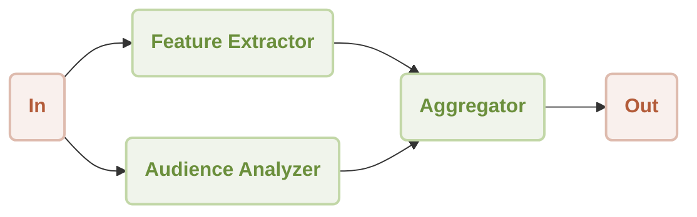

# Workflow Concurrency Demo

This is a demonstration of using [AIGNE Framework](https://github.com/AIGNE-io/aigne-framework) to build a concurrency workflow.



## Prerequisites

- [Node.js](https://nodejs.org) and npm installed on your machine
- [OpenAI API key](https://platform.openai.com/api-keys) used to interact with OpenAI API
- [Pnpm](https://pnpm.io) [Optional] if you want to run the example from source code

## Try without Installation

```bash
export OPENAI_API_KEY=YOUR_OPENAI_API_KEY # setup your OpenAI API key

npx -y @aigne/example-workflow-concurrency # run the example
```

## Installation

### Clone the Repository

```bash
git clone https://github.com/AIGNE-io/aigne-framework
```

### Install Dependencies

```bash
cd aigne-framework/examples/workflow-concurrency

pnpm install
```

### Setup Environment Variables

Setup your OpenAI API key in the `.env.local` file:

```bash
OPENAI_API_KEY="" # setup your OpenAI API key here
```

### Run the Example

```bash
pnpm start
```

## Example

The following example demonstrates how to build a concurrency workflow:

```typescript
import assert from "node:assert";
import { AIAgent, OpenAIChatModel, ExecutionEngine, parallel } from "@aigne/core-next";

const { OPENAI_API_KEY } = process.env;
assert(OPENAI_API_KEY, "Please set the OPENAI_API_KEY environment variable");

const model = new OpenAIChatModel({
  apiKey: OPENAI_API_KEY,
});

const featureExtractor = AIAgent.from({
  instructions: `\
You are a product analyst. Extract and summarize the key features of the product.

Product description:
{{product}}`,
  outputKey: "features",
});

const audienceAnalyzer = AIAgent.from({
  instructions: `\
You are a market researcher. Identify the target audience for the product.

Product description:
{{product}}`,
  outputKey: "audience",
});

const engine = new ExecutionEngine({ model });

const result = await engine.call(parallel(featureExtractor, audienceAnalyzer), {
  product: "AIGNE is a No-code Generative AI Apps Engine",
});

console.log(result);

// Output:
// {
//   features: "**Product Name:** AIGNE\n\n**Product Type:** No-code Generative AI Apps Engine\n\n...",
//   audience: "**Small to Medium Enterprises (SMEs)**: \n   - Businesses that may not have extensive IT resources or budget for app development but are looking to leverage AI to enhance their operations or customer engagement.\n\n...",
// }
```

## License

This project is licensed under the MIT License.
