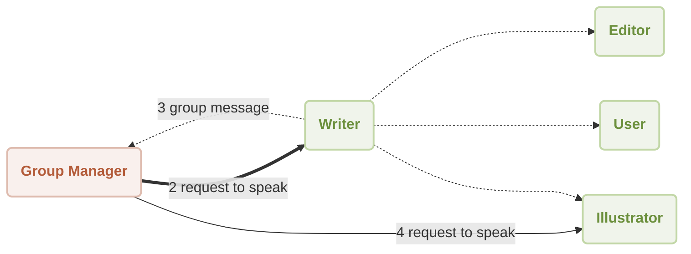

# Workflow Group Chat Demo

This is a demonstration of using [AIGNE Framework](https://github.com/AIGNE-io/aigne-framework) to build a group chat workflow.



## Prerequisites

- [Node.js](https://nodejs.org) and npm installed on your machine
- [OpenAI API key](https://platform.openai.com/api-keys) used to interact with OpenAI API
- [Pnpm](https://pnpm.io) [Optional] if you want to run the example from source code

## Try without Installation

```bash
export OPENAI_API_KEY=YOUR_OPENAI_API_KEY # setup your OpenAI API key

npx -y @aigne/example-workflow-group-chat # run the example
```

## Installation

### Clone the Repository

```bash
git clone https://github.com/AIGNE-io/aigne-framework
```

### Install Dependencies

```bash
cd aigne-framework/examples/workflow-group-chat

pnpm install
```

### Setup Environment Variables

Setup your OpenAI API key in the `.env.local` file:

```bash
OPENAI_API_KEY="" # setup your OpenAI API key here
```

### Run the Example

```bash
pnpm start
```

## License

This project is licensed under the MIT License.
