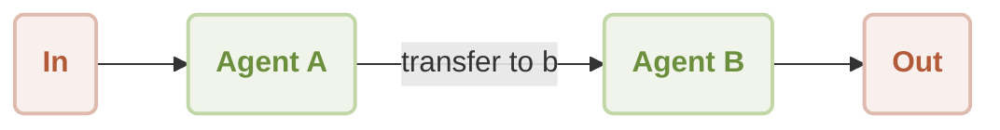
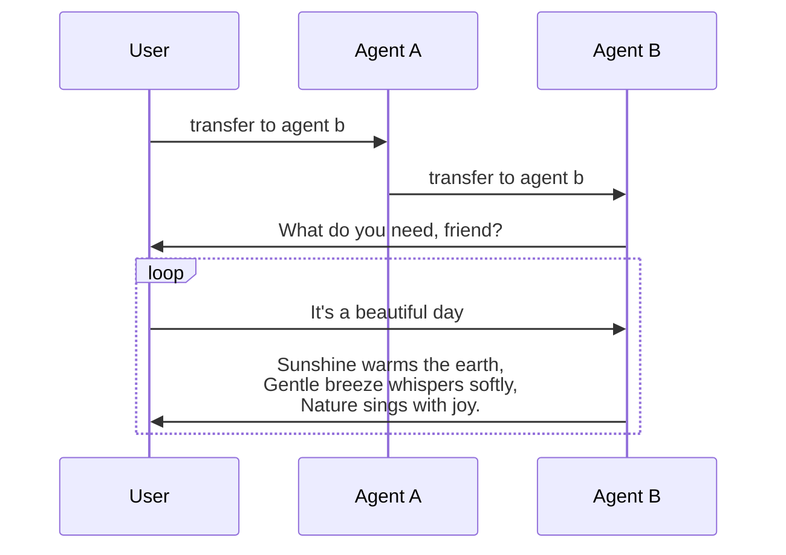

# Workflow Handoff Demo

This is a demonstration of using [AIGNE Framework](https://github.com/AIGNE-io/aigne-framework) to build a handoff workflow. The example now supports both one-shot and interactive chat modes, along with customizable model settings and pipeline input/output.



Workflow of a handoff between user and two agents:




## Prerequisites

- [Node.js](https://nodejs.org) and npm installed on your machine
- An [OpenAI API key](https://platform.openai.com/api-keys) for interacting with OpenAI's services
- Optional dependencies (if running the example from source code):
  - [Bun](https://bun.sh) for running unit tests & examples
  - [Pnpm](https://pnpm.io) for package management

## Quick Start (No Installation Required)

```bash
export OPENAI_API_KEY=YOUR_OPENAI_API_KEY # Set your OpenAI API key

# Run in one-shot mode (default)
npx -y @aigne/example-workflow-handoff

# Run in interactive chat mode
npx -y @aigne/example-workflow-handoff --chat

# Use pipeline input
echo "transfer to agent b" | npx -y @aigne/example-workflow-handoff
```

## Installation

### Clone the Repository

```bash
git clone https://github.com/AIGNE-io/aigne-framework
```

### Install Dependencies

```bash
cd aigne-framework/examples/workflow-handoff

pnpm install
```

### Setup Environment Variables

Setup your OpenAI API key in the `.env.local` file:

```bash
OPENAI_API_KEY="" # Set your OpenAI API key here
```

### Run the Example

```bash
pnpm start # Run in one-shot mode (default)

# Run in interactive chat mode
pnpm start -- --chat

# Use pipeline input
echo "transfer to agent b" | pnpm start
```

### Run Options

The example supports the following command-line parameters:

| Parameter | Description | Default |
|-----------|-------------|---------|
| `--chat` | Run in interactive chat mode | Disabled (one-shot mode) |
| `--model <provider[:model]>` | AI model to use in format 'provider[:model]' where model is optional. Examples: 'openai' or 'openai:gpt-4o-mini' | openai |
| `--temperature <value>` | Temperature for model generation | Provider default |
| `--top-p <value>` | Top-p sampling value | Provider default |
| `--presence-penalty <value>` | Presence penalty value | Provider default |
| `--frequency-penalty <value>` | Frequency penalty value | Provider default |
| `--log-level <level>` | Set logging level (ERROR, WARN, INFO, DEBUG, TRACE) | INFO |
| `--input`, `-i <input>` | Specify input directly | None |

#### Examples

```bash
# Run in chat mode (interactive)
pnpm start -- --chat

# Set logging level
pnpm start -- --log-level DEBUG

# Use pipeline input
echo "transfer to agent b" | pnpm start
```

## Example

The following example demonstrates how to build a handoff workflow:

```typescript
import assert from "node:assert";
import { AIAgent, AIGNE } from "@aigne/core";
import { OpenAIChatModel } from "@aigne/core/models/openai-chat-model.js";

const { OPENAI_API_KEY } = process.env;
assert(OPENAI_API_KEY, "Please set the OPENAI_API_KEY environment variable");

const model = new OpenAIChatModel({
  apiKey: OPENAI_API_KEY,
});

function transfer_to_b() {
  return agentB;
}

const agentA = AIAgent.from({
  name: "AgentA",
  instructions: "You are a helpful agent.",
  outputKey: "A",
  skills: [transfer_to_b],
});

const agentB = AIAgent.from({
  name: "AgentB",
  instructions: "Only speak in Haikus.",
  outputKey: "B",
});

const aigne = new AIGNE({ model });

const userAgent = aigne.invoke(agentA);

const result1 = await userAgent.invoke("transfer to agent b");
console.log(result1);
// Output:
// {
//   B: "Transfer now complete,  \nAgent B is here to help.  \nWhat do you need, friend?",
// }

const result2 = await userAgent.invoke("It's a beautiful day");
console.log(result2);
// Output:
// {
//   B: "Sunshine warms the earth,  \nGentle breeze whispers softly,  \nNature sings with joy.  ",
// }
```

## License

This project is licensed under the MIT License.
