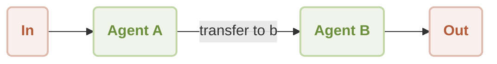
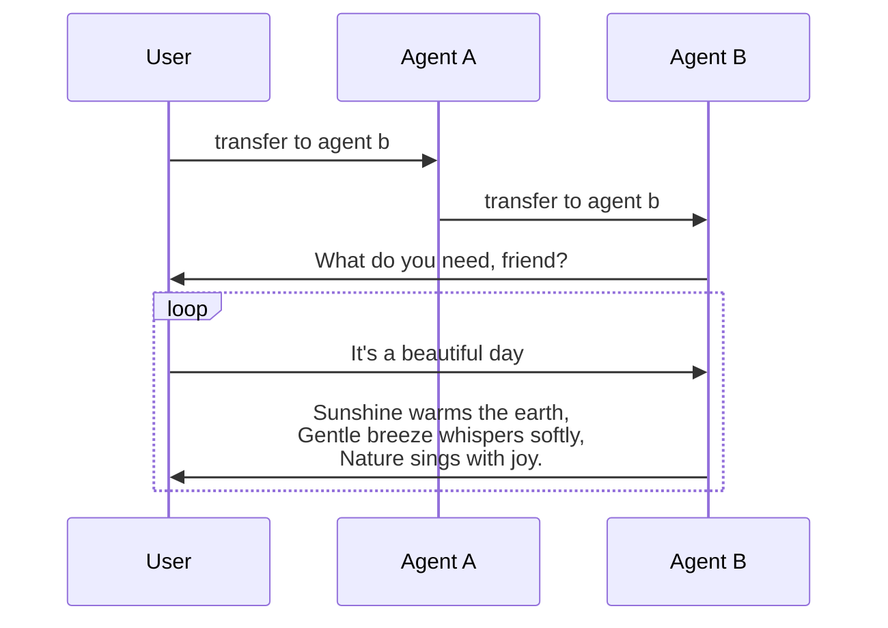

# Workflow Handoff Demo

This is a demonstration of using [AIGNE Framework](https://github.com/AIGNE-io/aigne-framework) to build a handoff workflow.



Workflow of a handoff between user and two agents:




## Prerequisites

- [Node.js](https://nodejs.org) and npm installed on your machine
- [Bun](https://bun.sh) installed on your machine
- [OpenAI API key](https://platform.openai.com/api-keys) used to interact with OpenAI API
- [Pnpm](https://pnpm.io) [Optional] if you want to run the example from source code

## Try without Installation

```bash
export OPENAI_API_KEY=YOUR_OPENAI_API_KEY # setup your OpenAI API key

npx -y @aigne/example-workflow-handoff # run the example
```

## Installation

### Clone the Repository

```bash
git clone https://github.com/AIGNE-io/aigne-framework
```

### Install Dependencies

```bash
cd aigne-framework/examples/workflow-handoff

pnpm install
```

### Setup Environment Variables

Setup your OpenAI API key in the `.env.local` file:

```bash
OPENAI_API_KEY="" # setup your OpenAI API key here
```

### Run the Example

```bash
pnpm start
```

## Example

The following example demonstrates how to build a handoff workflow:

```typescript
import assert from "node:assert";
import { AIAgent, ExecutionEngine } from "@aigne/core";
import { OpenAIChatModel } from "@aigne/core/models/openai-chat-model.js";

const { OPENAI_API_KEY } = process.env;
assert(OPENAI_API_KEY, "Please set the OPENAI_API_KEY environment variable");

const model = new OpenAIChatModel({
  apiKey: OPENAI_API_KEY,
});

function transfer_to_b() {
  return agentB;
}

const agentA = AIAgent.from({
  name: "AgentA",
  instructions: "You are a helpful agent.",
  outputKey: "A",
  tools: [transfer_to_b],
});

const agentB = AIAgent.from({
  name: "AgentB",
  instructions: "Only speak in Haikus.",
  outputKey: "B",
});

const engine = new ExecutionEngine({ model });

const userAgent = engine.call(agentA);

const result1 = await userAgent.call("transfer to agent b");
console.log(result1);
// Output:
// {
//   B: "Transfer now complete,  \nAgent B is here to help.  \nWhat do you need, friend?",
// }

const result2 = await userAgent.call("It's a beautiful day");
console.log(result2);
// Output:
// {
//   B: "Sunshine warms the earth,  \nGentle breeze whispers softly,  \nNature sings with joy.  ",
// }
```

## License

This project is licensed under the MIT License.
