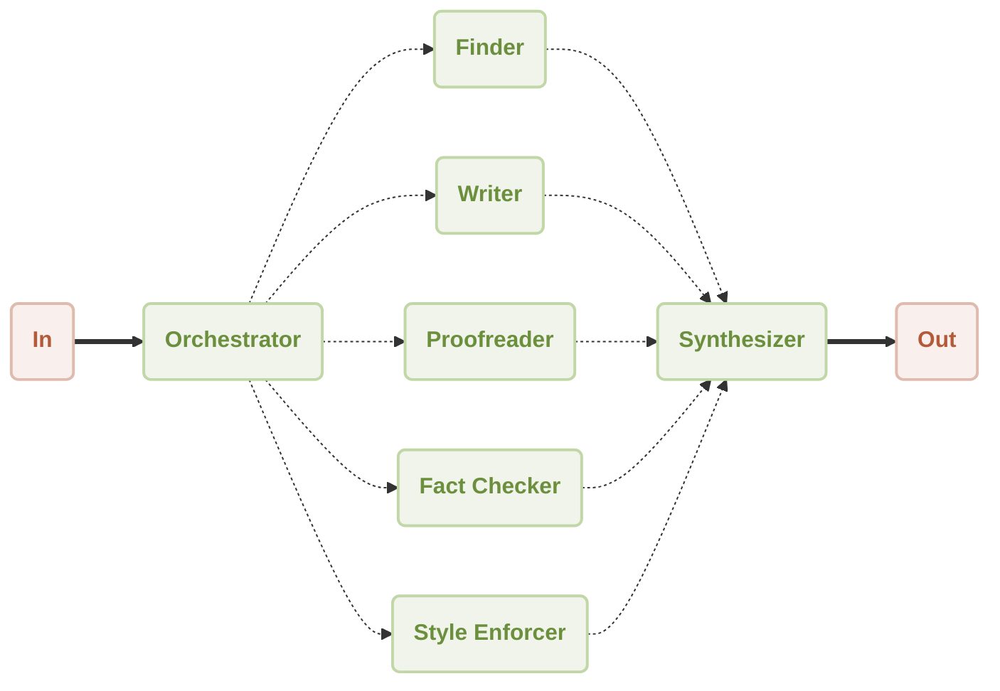

# Workflow Orchestrator Demo

This is a demonstration of using [AIGNE Framework](https://github.com/AIGNE-io/aigne-framework) to build a orchestrator workflow.



## Prerequisites

- [Node.js](https://nodejs.org) and npm installed on your machine
- [OpenAI API key](https://platform.openai.com/api-keys) used to interact with OpenAI API
- [Pnpm](https://pnpm.io) [Optional] if you want to run the example from source code

## Try without Installation

```bash
export OPENAI_API_KEY=YOUR_OPENAI_API_KEY # setup your OpenAI API key

npx -y @aigne/example-workflow-orchestrator # run the example
```

## Installation

### Clone the Repository

```bash
git clone https://github.com/AIGNE-io/aigne-framework
```

### Install Dependencies

```bash
cd aigne-framework/examples/workflow-orchestrator

pnpm install
```

### Setup Environment Variables

Setup your OpenAI API key in the `.env.local` file:

```bash
OPENAI_API_KEY="" # setup your OpenAI API key here
```

When running Puppeteer inside a Docker container, set the following environment variable:

```
DOCKER_CONTAINER="true"
```

This ensures Puppeteer configures itself correctly for a Docker environment, preventing potential compatibility issues.

### Run the Example

```bash
pnpm start
```

## Example

The following example demonstrates how to build a orchestrator workflow:

Here is the generated report for this example: [arcblock-deep-research.md](./generated-report-arcblock.md)

```typescript
import assert from "node:assert";
import { OrchestratorAgent } from "@aigne/agent-library";
import {
  AIAgent,
  ChatModelOpenAI,
  ExecutionEngine,
  MCPAgent,
} from "@aigne/core-next";

const { OPENAI_API_KEY } = process.env;
assert(OPENAI_API_KEY, "Please set the OPENAI_API_KEY environment variable");

const model = new ChatModelOpenAI({
  apiKey: OPENAI_API_KEY,
});

const puppeteer = await MCPAgent.from({
  command: "npx",
  args: ["-y", "@modelcontextprotocol/server-puppeteer"],
  env: {
    ...(process.env as Record<string, string>),
  },
});

const finder = AIAgent.from({
  name: "finder",
  description: "Find the closest match to a user's request",
  instructions: `You are an agent with access to the filesystem,
  as well as the ability to fetch URLs. Your job is to identify
  the closest match to a user's request, make the appropriate tool calls,
  and return the URI and CONTENTS of the closest match.

  Rules:
  - use document.body.innerText to get the text content of a page
  - if you want a url to some page, you should get all link and it's title of current(home) page,
  then you can use the title to search the url of the page you want to visit.
  `,
  tools: [puppeteer],
});

const enhancedFinder = OrchestratorAgent.from({
  name: "enhanced_finder",
  description: "Enhanced finder with more tools",
  tools: [finder],
});

const filesystem = await MCPAgent.from({
  command: "npx",
  args: ["-y", "@modelcontextprotocol/server-filesystem", import.meta.dir],
});

const writer = AIAgent.from({
  name: "writer",
  description: "Write to the filesystem",
  instructions: `You are an agent that can write to the filesystem.
  You are tasked with taking the user's input, addressing it, and
  writing the result to disk in the appropriate location.`,
  tools: [filesystem],
});

const proofreader = AIAgent.from({
  name: "proofreader",
  description:
    "Review the short story for grammar, spelling, and punctuation errors",
  instructions: `Review the short story for grammar, spelling, and punctuation errors.
  Identify any awkward phrasing or structural issues that could improve clarity.
  Provide detailed feedback on corrections.`,
  tools: [],
});

const fact_checker = AIAgent.from({
  name: "fact_checker",
  description: "Verify the factual consistency within the story",
  instructions: `Verify the factual consistency within the story. Identify any contradictions,
  logical inconsistencies, or inaccuracies in the plot, character actions, or setting.
  Highlight potential issues with reasoning or coherence.`,
  tools: [],
});

const style_enforcer = AIAgent.from({
  name: "style_enforcer",
  description: "Analyze the story for adherence to style guidelines",
  instructions: `Analyze the story for adherence to style guidelines.
  Evaluate the narrative flow, clarity of expression, and tone. Suggest improvements to
  enhance storytelling, readability, and engagement.`,
  tools: [],
});

const agent = OrchestratorAgent.from({
  tools: [enhancedFinder, writer, proofreader, fact_checker, style_enforcer],
});

const engine = new ExecutionEngine({ model });

const result = await engine.run(
  `\
Conduct an in-depth research on ArcBlock using only the official website\
(avoid search engines or third-party sources) and compile a detailed report saved as arcblock.md. \
The report should include comprehensive insights into the company's products \
(with detailed research findings and links), technical architecture, and future plans.`,
  agent
);
console.log(result);
// Output:
// {
//   text: "Having completed the research and documentation tasks focused on ArcBlock, the final deliverable, a comprehensive report titled \"arcblock.md,\" has been created. ...",
// }
```

## License

This project is licensed under the MIT License.
