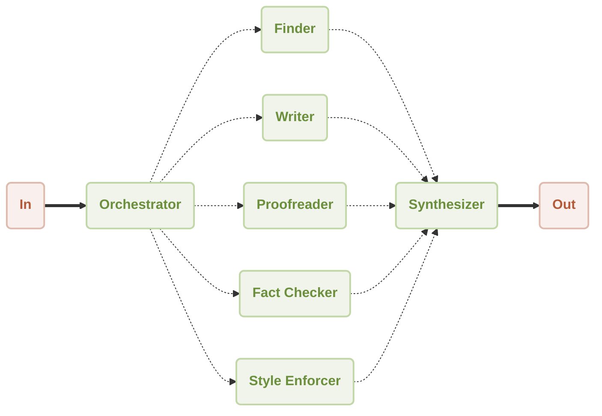

# Workflow Orchestrator Demo

This is a demonstration of using [AIGNE Framework](https://github.com/AIGNE-io/aigne-framework) to build a orchestrator workflow.



## Prerequisites

- [Node.js](https://nodejs.org) and npm installed on your machine
- [Bun](https://bun.sh) installed on your machine
- [OpenAI API key](https://platform.openai.com/api-keys) used to interact with OpenAI API
- [Pnpm](https://pnpm.io) [Optional] if you want to run the example from source code

## Try without Installation

```bash
export OPENAI_API_KEY=YOUR_OPENAI_API_KEY # setup your OpenAI API key

npx -y @aigne/example-workflow-orchestrator # run the example
```

## Installation

### Clone the Repository

```bash
git clone https://github.com/AIGNE-io/aigne-framework
```

### Install Dependencies

```bash
cd aigne-framework/examples/workflow-orchestrator

pnpm install
```

### Setup Environment Variables

Setup your OpenAI API key in the `.env.local` file:

```bash
OPENAI_API_KEY="" # setup your OpenAI API key here
```

When running Puppeteer inside a Docker container, set the following environment variable:

```
DOCKER_CONTAINER="true"
```

This ensures Puppeteer configures itself correctly for a Docker environment, preventing potential compatibility issues.

### Run the Example

```bash
pnpm start
```

## Example

The following example demonstrates how to build a orchestrator workflow:

Here is the generated report for this example: [arcblock-deep-research.md](./generated-report-arcblock.md)

```typescript
import assert from "node:assert";
import { OrchestratorAgent } from "@aigne/agent-library/orchestrator/index.js";
import { AIAgent, ExecutionEngine, MCPAgent } from "@aigne/core";
import { OpenAIChatModel } from "@aigne/core/models/openai-chat-model.js";

const { OPENAI_API_KEY } = process.env;
assert(OPENAI_API_KEY, "Please set the OPENAI_API_KEY environment variable");

const model = new OpenAIChatModel({
  apiKey: OPENAI_API_KEY,
  modelOptions: {
    parallelToolCalls: false, // puppeteer can only run one task at a time
  },
});

const puppeteer = await MCPAgent.from({
  command: "npx",
  args: ["-y", "@modelcontextprotocol/server-puppeteer"],
  env: process.env as Record<string, string>,
});

const filesystem = await MCPAgent.from({
  command: "npx",
  args: ["-y", "@modelcontextprotocol/server-filesystem", import.meta.dir],
});

const finder = AIAgent.from({
  name: "finder",
  description: "Find the closest match to a user's request",
  instructions: `You are an agent that can find information on the web.
You are tasked with finding the closest match to the user's request.
You can use puppeteer to scrape the web for information.
You can also use the filesystem to save the information you find.

Rules:
- do not use screenshot of puppeteer
- use document.body.innerText to get the text content of a page
- if you want a url to some page, you should get all link and it's title of current(home) page,
then you can use the title to search the url of the page you want to visit.
  `,
  tools: [puppeteer, filesystem],
});

const writer = AIAgent.from({
  name: "writer",
  description: "Write to the filesystem",
  instructions: `You are an agent that can write to the filesystem.
  You are tasked with taking the user's input, addressing it, and
  writing the result to disk in the appropriate location.`,
  tools: [filesystem],
});

const agent = OrchestratorAgent.from({
  tools: [finder, writer],
  maxIterations: 3,
  tasksConcurrency: 1, // puppeteer can only run one task at a time
});

const engine = new ExecutionEngine({ model });

const result = await engine.call(
  agent,
  `\
Conduct an in-depth research on ArcBlock using only the official website\
(avoid search engines or third-party sources) and compile a detailed report saved as arcblock.md. \
The report should include comprehensive insights into the company's products \
(with detailed research findings and links), technical architecture, and future plans.`,
);
console.log(result);
// Output:
// {
//   $message: "The objective of conducting in-depth research on ArcBlock using only the official website has been successfully completed...",
// }
```

## License

This project is licensed under the MIT License.
