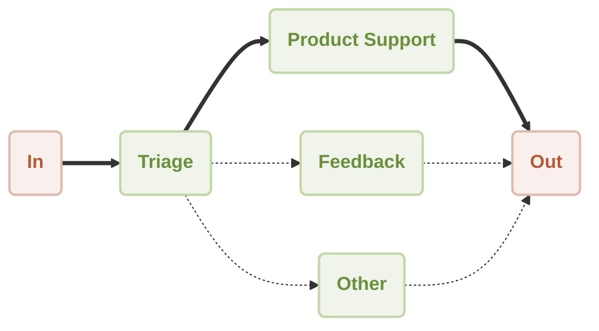

# Workflow Router Demo

This is a demonstration of using [AIGNE Framework](https://github.com/AIGNE-io/aigne-framework) to build a router workflow. The example now supports both one-shot and interactive chat modes, along with customizable model settings and pipeline input/output.



## Prerequisites

- [Node.js](https://nodejs.org) and npm installed on your machine
- An [OpenAI API key](https://platform.openai.com/api-keys) for interacting with OpenAI's services
- Optional dependencies (if running the example from source code):
  - [Bun](https://bun.sh) for running unit tests & examples
  - [Pnpm](https://pnpm.io) for package management

## Quick Start (No Installation Required)

```bash
export OPENAI_API_KEY=YOUR_OPENAI_API_KEY # Set your OpenAI API key

# Run in one-shot mode (default)
npx -y @aigne/example-workflow-router

# Run in interactive chat mode
npx -y @aigne/example-workflow-router --chat

# Use pipeline input
echo "How do I return a product?" | npx -y @aigne/example-workflow-router
```

## Installation

### Clone the Repository

```bash
git clone https://github.com/AIGNE-io/aigne-framework
```

### Install Dependencies

```bash
cd aigne-framework/examples/workflow-router

pnpm install
```

### Setup Environment Variables

Setup your OpenAI API key in the `.env.local` file:

```bash
OPENAI_API_KEY="" # Set your OpenAI API key here
```

### Run the Example

```bash
pnpm start # Run in one-shot mode (default)

# Run in interactive chat mode
pnpm start -- --chat

# Use pipeline input
echo "How do I return a product?" | pnpm start
```

### Run Options

The example supports the following command-line parameters:

| Parameter | Description | Default |
|-----------|-------------|---------|
| `--chat` | Run in interactive chat mode | Disabled (one-shot mode) |
| `--model <provider[:model]>` | AI model to use in format 'provider[:model]' where model is optional. Examples: 'openai' or 'openai:gpt-4o-mini' | openai |
| `--temperature <value>` | Temperature for model generation | Provider default |
| `--top-p <value>` | Top-p sampling value | Provider default |
| `--presence-penalty <value>` | Presence penalty value | Provider default |
| `--frequency-penalty <value>` | Frequency penalty value | Provider default |
| `--log-level <level>` | Set logging level (ERROR, WARN, INFO, DEBUG, TRACE) | INFO |
| `--input`, `-i <input>` | Specify input directly | None |

#### Examples

```bash
# Run in chat mode (interactive)
pnpm start -- --chat

# Set logging level
pnpm start -- --log-level DEBUG

# Use pipeline input
echo "How do I return a product?" | pnpm start
```

## Example

The following example demonstrates how to build a router workflow:

```typescript
import assert from "node:assert";
import { AIAgent, AIGNE } from "@aigne/core";
import { OpenAIChatModel } from "@aigne/core/models/openai-chat-model.js";

const { OPENAI_API_KEY } = process.env;
assert(OPENAI_API_KEY, "Please set the OPENAI_API_KEY environment variable");

const model = new OpenAIChatModel({
  apiKey: OPENAI_API_KEY,
});

const productSupport = AIAgent.from({
  name: "product_support",
  description: "Agent to assist with any product-related questions.",
  instructions: `You are an agent capable of handling any product-related questions.
  Your goal is to provide accurate and helpful information about the product.
  Be polite, professional, and ensure the user feels supported.`,
  outputKey: "product_support",
});

const feedback = AIAgent.from({
  name: "feedback",
  description: "Agent to assist with any feedback-related questions.",
  instructions: `You are an agent capable of handling any feedback-related questions.
  Your goal is to listen to the user's feedback, acknowledge their input, and provide appropriate responses.
  Be empathetic, understanding, and ensure the user feels heard.`,
  outputKey: "feedback",
});

const other = AIAgent.from({
  name: "other",
  description: "Agent to assist with any general questions.",
  instructions: `You are an agent capable of handling any general questions.
  Your goal is to provide accurate and helpful information on a wide range of topics.
  Be friendly, knowledgeable, and ensure the user feels satisfied with the information provided.`,
  outputKey: "other",
});

const triage = AIAgent.from({
  name: "triage",
  instructions: `You are an agent capable of routing questions to the appropriate agent.
  Your goal is to understand the user's query and direct them to the agent best suited to assist them.
  Be efficient, clear, and ensure the user is connected to the right resource quickly.`,
  skills: [productSupport, feedback, other],
  toolChoice: "router", // Set toolChoice to "router" to enable router mode
});

const aigne = new AIGNE({ model });

const result1 = await aigne.invoke(triage, "How to use this product?");
console.log(result1);
// {
//   product_support: "I’d be happy to help you with that! However, I need to know which specific product you’re referring to. Could you please provide me with the name or type of product you have in mind?",
// }

const result2 = await aigne.invoke(triage, "I have feedback about the app.");
console.log(result2);
// {
//   feedback: "Thank you for sharing your feedback! I'm here to listen. Please go ahead and let me know what you’d like to share about the app.",
// }

const result3 = await aigne.invoke(triage, "What is the weather today?");
console.log(result3);
// {
//   other: "I can't provide real-time weather updates. However, you can check a reliable weather website or a weather app on your phone for the current conditions in your area. If you tell me your location, I can suggest a few sources where you can find accurate weather information!",
// }
```

## License

This project is licensed under the MIT License.
