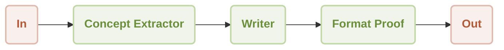

# Workflow Sequential Demo

This is a demonstration of using [AIGNE Framework](https://github.com/AIGNE-io/aigne-framework) to build a sequential workflow. The example now supports both one-shot and interactive chat modes, along with customizable model settings and pipeline input/output.



## Prerequisites

- [Node.js](https://nodejs.org) and npm installed on your machine
- An [OpenAI API key](https://platform.openai.com/api-keys) for interacting with OpenAI's services
- Optional dependencies (if running the example from source code):
  - [Bun](https://bun.sh) for running unit tests & examples
  - [Pnpm](https://pnpm.io) for package management

## Quick Start (No Installation Required)

```bash
export OPENAI_API_KEY=YOUR_OPENAI_API_KEY # Set your OpenAI API key

# Run in one-shot mode (default)
npx -y @aigne/example-workflow-sequential

# Run in interactive chat mode
npx -y @aigne/example-workflow-sequential --chat

# Use pipeline input
echo "Create marketing content for our new AI-powered fitness app" | npx -y @aigne/example-workflow-sequential
```

## Installation

### Clone the Repository

```bash
git clone https://github.com/AIGNE-io/aigne-framework
```

### Install Dependencies

```bash
cd aigne-framework/examples/workflow-sequential

pnpm install
```

### Setup Environment Variables

Setup your OpenAI API key in the `.env.local` file:

```bash
OPENAI_API_KEY="" # Set your OpenAI API key here
```

### Run the Example

```bash
pnpm start # Run in one-shot mode (default)

# Run in interactive chat mode
pnpm start -- --chat

# Use pipeline input
echo "Create marketing content for our new AI-powered fitness app" | pnpm start
```

### Run Options

The example supports the following command-line parameters:

| Parameter | Description | Default |
|-----------|-------------|---------|
| `--chat` | Run in interactive chat mode | Disabled (one-shot mode) |
| `--model <provider[:model]>` | AI model to use in format 'provider[:model]' where model is optional. Examples: 'openai' or 'openai:gpt-4o-mini' | openai |
| `--temperature <value>` | Temperature for model generation | Provider default |
| `--top-p <value>` | Top-p sampling value | Provider default |
| `--presence-penalty <value>` | Presence penalty value | Provider default |
| `--frequency-penalty <value>` | Frequency penalty value | Provider default |
| `--log-level <level>` | Set logging level (ERROR, WARN, INFO, DEBUG, TRACE) | INFO |
| `--input`, `-i <input>` | Specify input directly | None |

#### Examples

```bash
# Run in chat mode (interactive)
pnpm start -- --chat

# Set logging level
pnpm start -- --log-level DEBUG

# Use pipeline input
echo "Create marketing content for our new AI-powered fitness app" | pnpm start
```

## Example

The following example demonstrates how to build a sequential workflow:

```typescript
import assert from "node:assert";
import { AIAgent, AIGNE, TeamAgent, ProcessMode } from "@aigne/core";
import { OpenAIChatModel } from "@aigne/core/models/openai-chat-model.js";

const { OPENAI_API_KEY } = process.env;
assert(OPENAI_API_KEY, "Please set the OPENAI_API_KEY environment variable");

const model = new OpenAIChatModel({
  apiKey: OPENAI_API_KEY,
});

const conceptExtractor = AIAgent.from({
  instructions: `\
You are a marketing analyst. Give a product description, identity:
- Key features
- Target audience
- Unique selling points

Product description:
{{product}}`,
  outputKey: "concept",
});

const writer = AIAgent.from({
  instructions: `\
You are a marketing copywriter. Given a block of text describing features, audience, and USPs,
compose a compelling marketing copy (like a newsletter section) that highlights these points.
Output should be short (around 150 words), output just the copy as a single text block.

Product description:
{{product}}

Below is the info about the product:
{{concept}}`,
  outputKey: "draft",
});

const formatProof = AIAgent.from({
  instructions: `\
You are an editor. Given the draft copy, correct grammar, improve clarity, ensure consistent tone,
give format and make it polished. Output the final improved copy as a single text block.

Product description:
{{product}}

Below is the info about the product:
{{concept}}

Draft copy:
{{draft}}`,
  outputKey: "content",
});

const aigne = new AIGNE({ model });

// 创建一个 TeamAgent 来处理顺序工作流
const teamAgent = TeamAgent.from({
  skills: [conceptExtractor, writer, formatProof],
  mode: ProcessMode.sequential // 默认值，可以省略
});

const result = await aigne.invoke(teamAgent, {
  product: "AIGNE is a No-code Generative AI Apps Engine",
});

console.log(result);

// Output:
// {
//   concept: "**Product Description: AIGNE - No-code Generative AI Apps Engine**\n\nAIGNE is a cutting-edge No-code Generative AI Apps Engine designed to empower users to seamlessly create ...",
//   draft: "Unlock the power of creation with AIGNE, the revolutionary No-code Generative AI Apps Engine! Whether you're a small business looking to streamline operations, an entrepreneur ...",
//   content: "Unlock the power of creation with AIGNE, the revolutionary No-Code Generative AI Apps Engine! Whether you are a small business aiming to streamline operations, an entrepreneur ...",
// }
```

## License

This project is licensed under the MIT License.
