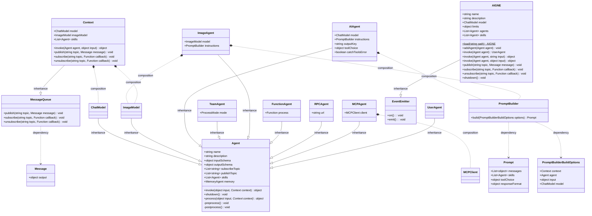

## Class Definitions

```mermaid
classDiagram
    class PromptBuilderBuildOptions {
        +Context context
        +Agent agent
        +object input
        +ChatModel model
    }

    class Prompt {
        +List~object~ messages
        +List~Agent~ skills
        +object toolChoice
        +object responseFormat
    }

    PromptBuilder ..> PromptBuilderBuildOptions: dependency
    PromptBuilder ..> Prompt: dependency
    class PromptBuilder {
        +build(PromptBuilderBuildOptions options) Prompt
    }

    ChatModel --|> Agent: inheritance
    class ChatModel {
    }

    ImageModel --|> Agent: inheritance
    class ImageModel {
    }

    class Agent {
        +string name
        +string description
        +object inputSchema
        +object outputSchema
        +List~string~ subscribeTopic
        +List~string~ publishTopic
        +List~Agent~ skills
        +MemoryAgent memory

        +invoke(object input, Context context) object
        +shutdown() void
        +process(object input, Context context) object*
        -preprocess() void
        -postprocess() void
    }

    AIAgent --|> Agent: inheritance
    AIAgent *.. PromptBuilder: composition
    class AIAgent {
        +ChatModel model
        +PromptBuilder instructions
        +string outputKey
        +object toolChoice
        +boolean catchToolsError
    }

    TeamAgent --|> Agent: inheritance
    class TeamAgent {
        +ProcessMode mode
    }

    ImageAgent --|> Agent: inheritance
    ImageAgent *.. PromptBuilder: composition
    ImageAgent *.. ImageModel: composition
    class ImageAgent {
        +ImageModel model
        +PromptBuilder instructions
    }

    FunctionAgent --|> Agent: inheritance
    class FunctionAgent {
        +Function process
    }

    RPCAgent --|> Agent: inheritance
    class RPCAgent {
        +string url
    }

    MCPAgent --|> Agent: inheritance
    MCPAgent *.. MCPClient: composition
    class MCPAgent {
        +MCPClient client
    }

    class MCPClient {
    }

    class Message {
        +object output
    }

    MessageQueue ..> Message: dependency
    class MessageQueue {
        +publish(string topic, Message message) void
        +subscribe(string topic, Function callback) void
        +unsubscribe(string topic, Function callback) void
    }

    Context *.. ChatModel: composition
    Context *.. ImageModel: composition
    Context --|> MessageQueue: inheritance
    class Context {
        +ChatModel model
        +ImageModel imageModel
        +List~Agent~ skills

        +invoke(Agent agent, object input) object
        +publish(string topic, Message message) void
        +subscribe(string topic, Function callback) void
        +unsubscribe(string topic, Function callback) void
    }

    UserAgent --|> Agent: inheritance
    class UserAgent {
    }

    class EventEmitter {
        +on(): void
        +emit(): void
    }

    AIGNE --|> EventEmitter: inheritance
    class AIGNE {
        +string name
        +string description
        +ChatModel model
        +object limits
        +List~Agent~ agents
        +List~Agent~ skills

        +load(string path) AIGNE$
        +addAgent(Agent agent) void
        +invoke(Agent agent) UserAgent
        +invoke(Agent agent, string input) object
        +invoke(Agent agent, object input) object
        +publish(string topic, Message message) void
        +subscribe(string topic, Function callback) void
        +unsubscribe(string topic, Function callback) void
        +shutdown() void
    }
```
