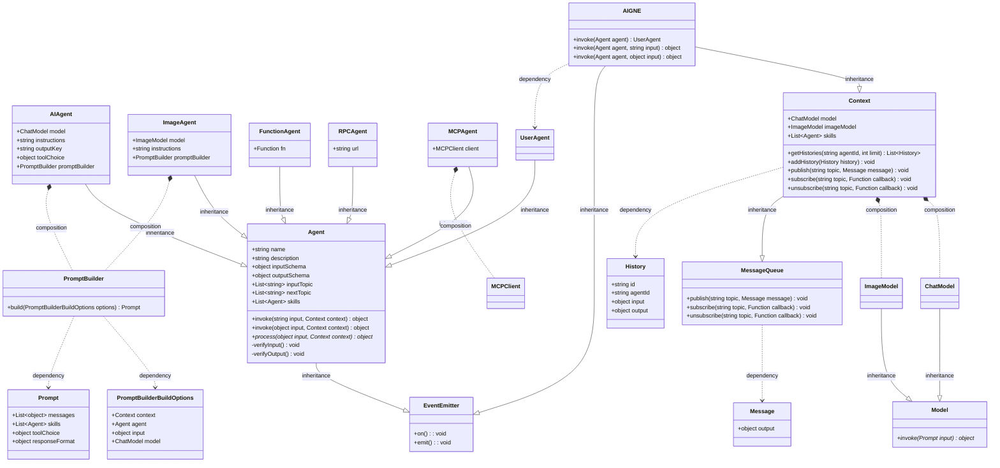

## Class Definitions

```mermaid
classDiagram
    class PromptBuilderBuildOptions {
        +Context context
        +Agent agent
        +object input
        +ChatModel model
    }

    class Prompt {
        +List~object~ messages
        +List~Agent~ skills
        +object toolChoice
        +object responseFormat
    }

    PromptBuilder ..> PromptBuilderBuildOptions: dependency
    PromptBuilder ..> Prompt: dependency
    class PromptBuilder {
        +build(PromptBuilderBuildOptions options) Prompt
    }

    class Model {
        +invoke(Prompt input) object*
    }

    ChatModel --|> Model: inheritance
    class ChatModel {
    }

    ImageModel --|> Model: inheritance
    class ImageModel {
    }

    Agent --|> EventEmitter: inheritance
    class Agent {
        +string name
        +string description
        +object inputSchema
        +object outputSchema
        +List~string~ inputTopic
        +List~string~ nextTopic
        +List~Agent~ skills

        +invoke(string input, Context context) object
        +invoke(object input, Context context) object

        +process(object input, Context context) object*
        -verifyInput() void
        -verifyOutput() void
    }

    AIAgent --|> Agent: inheritance
    AIAgent *.. PromptBuilder: composition
    class AIAgent {
        +ChatModel model
        +string instructions
        +string outputKey
        +object toolChoice
        +PromptBuilder promptBuilder
    }

    ImageAgent --|> Agent: inheritance
    ImageAgent *.. PromptBuilder: composition
    class ImageAgent {
        +ImageModel model
        +string instructions
        +PromptBuilder promptBuilder
    }

    FunctionAgent --|> Agent: inheritance
    class FunctionAgent {
        +Function fn
    }

    RPCAgent --|> Agent: inheritance
    class RPCAgent {
        +string url
    }

    MCPAgent --|> Agent: inheritance
    MCPAgent *.. MCPClient: composition
    class MCPAgent {
        +MCPClient client
    }

    class MCPClient {
    }

    class Message {
        +object output
    }

    MessageQueue ..> Message: dependency
    class MessageQueue {
        +publish(string topic, Message message) void
        +subscribe(string topic, Function callback) void
        +unsubscribe(string topic, Function callback) void
    }

    class History {
        +string id
        +string agentId
        +object input
        +object output
    }

    Context *.. ChatModel: composition
    Context *.. ImageModel: composition
    Context --|> MessageQueue: inheritance
    Context ..> History: dependency
    class Context {
        +ChatModel model
        +ImageModel imageModel
        +List~Agent~ skills

        +getHistories(string agentId, int limit) List~History~
        +addHistory(History history) void
        +publish(string topic, Message message) void
        +subscribe(string topic, Function callback) void
        +unsubscribe(string topic, Function callback) void
    }

    class EventEmitter {
        +on(): void
        +emit(): void
    }

    UserAgent --|> Agent: inheritance
    class UserAgent {
    }


    AIGNE --|> Context: inheritance
    AIGNE --|> EventEmitter: inheritance
    AIGNE ..> UserAgent: dependency
    class AIGNE {
        +invoke(Agent agent) UserAgent
        +invoke(Agent agent, string input) object
        +invoke(Agent agent, object input) object
    }
```
